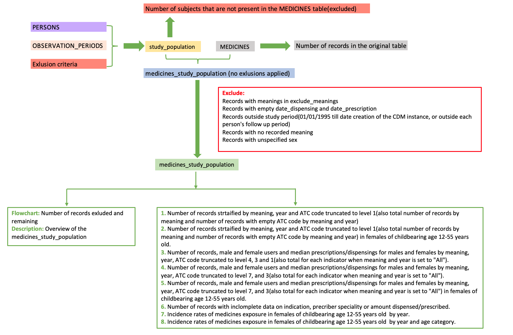

```{css,  echo = F}
/*-- Specify div's for 'boxes', change color of TOC and center align titles: --*/
div.box1 {background-color: #f5f5f0; border-radius: 5px; padding: 30px; margin-right: 0px}
div.box2 {background-color: #d4e5d2; border-radius: 5px; padding: 30px; margin-right: 0px}
div.box3 {border-style: solid; border-color: #f5f5f0; border-width: medium; border-radius: 30px; padding: 5px; margin-right: 0px}

.list-group-item.active, .list-group-item.active:focus, .list-group-item.active:hover {background-color: #76b82a; border-color: #76b82a}
h1 {text-align: center; color: #3c7b8a}
h2 {text-align: center; color: #76b82a}
h3

/*-- Add logo (based on https://rstudio4edu.github.io/rstudio4edu-book/rmd-fancy.html): --*/
#TOC::before {content: ""; display: block; height: 60px; margin: 30px 10px 30px; background-image: url("conception_logo.png"); background-size: contain; background-position: center center; background-repeat: no-repeat}
```

```{r set_locale, include=FALSE}
Sys.setlocale("LC_ALL", "C")
`%!in%` = Negate(`%in%`)
```

<div class = 'box1'>

**Level 3:** Medicines exposure in the study population 

 - **Script directory:** `r projectFolder`
 - **Date/time:** `r Sys.time()`
 - **DAP:** `r data_access_provider_name`
 - **Data source:** `r data_source_name`
 
</div>
 
<div class = 'box2'>
```{r time_log, echo=F}
if (subpopulations_present=="No"){
timelog_med<-fread(paste0(med_dir,"Time_log/", list.files(paste0(med_dir,"Time_log/"),"time_medicines.csv")))
kable(timelog_med)
} else {
timelog_med<-fread(paste0(med_dir,subpopulations_names[a], "/Time_log/","time_medicines.csv"))
kable(timelog_med)
}
```
</div>
<div class = 'box1'>
The analysis contains the following steps:

<br>



If subpopulations are available in your data the analysis will be performed separately for each subpopulation.
In case there is an overlapping subpopulation only subjects in the overlap period will be taken into account.
***Example:***

<br>


`year` is retrieved from `date_prescription` or `date_dispensing`. If both dates are present, `date_dispensing` will be used.

</div>

<br>

<div class = 'box3'>

## 1. Rates of medicine use


### Rates of medicines exposure in the study population by year and ATC code

<br>

When subjects are being followed(i.e. they contribute to the person time in a particular year) but do not have a dispensed/prescribed medicine, the truncated_atc_code variable will be set to N/A.

```{r rates_year, echo=F}
if (subpopulations_present=="No"){
  if(length(list.files(paste0(med_dir,"Masked/"), pattern="medicines_rates_year_atc_masked.csv"))>0){
tab15_med<-fread(paste0(med_dir,"Masked/", list.files(paste0(med_dir,"Masked/"), pattern="medicines_rates_year_atc_masked.csv")))
if (tab15_med[,.N]>0){
  if (tab15_med[,.N]>12000){
        print("If the table contanins more than 12000 records it can not be displayed in the report. For the complete table, go to g_output/MEDICINES/medicines_rates_year_atc_masked.csv")
    datatable(head(tab15_med,12000), options = list(scrollX=T))
  } else {
datatable(tab15_med, options = list(scrollX=T))
  }
} else {
  tab15_med<-NULL
    print("This table cannot be produced based on the available data.")
}
  } else {
      tab15_med<-NULL
    print("This table cannot be produced based on the available data.")
}
} else {
    if(length(list.files(paste0(med_dir,subpopulations_names[a], "/Masked/"), pattern="medicines_rates_year_atc_masked.csv"))>0){
  tab15_med<-fread(paste0(med_dir,subpopulations_names[a], "/Masked/", list.files(paste0(med_dir,subpopulations_names[a], "/Masked/"), pattern="medicines_rates_year_atc_masked.csv")))
  if (tab15_med[,.N]>0){
   if (tab15_med[,.N]>12000){   
            print("If the table contanins more than 12000 records it can not be displayed in the report. For the complete table, go to g_output/MEDICINES/medicines_rates_year_atc_masked.csv")
        datatable(head(tab15_med,12000), options = list(scrollX=T))
   } else {
datatable(tab15_med, options = list(scrollX=T))
   }
  } else {
      tab15_med<-NULL
      print("This table cannot be produced based on the available data.")
  }
    } else {
        tab15_med<-NULL
    print("This table cannot be produced based on the available data.")
    }
}
```

<br>

Counts smaller than 5 will be replaced with a count of 3. Then the approximate incidence rates will be calculated as the variable of interest divided by the person years and multiplied by 100. Rates in the graphs are rounded to one decimal digit for visualization purposes. Look at the table for more detailed rates.

#### Graph: Rates of medicines exposure by year and ATC code

```{r tab15_graph_medicines_f, echo=FALSE, warning=FALSE}
if(!is.null(tab15_med)){
tab15_graph_med<-tab15_med[no_records=="<5", no_records:= 3]
tab15_graph_med<-tab15_graph_med[,no_records:=as.numeric(no_records)]
tab15_graph_med<-tab15_graph_med[person_years=="<5", person_years:= 3]
tab15_graph_med<-tab15_graph_med[,person_years:=as.numeric(person_years)]
tab15_graph_med<-tab15_graph_med[,year:=as.factor(year)]
tab15_graph_med<-tab15_graph_med[medicines_per_100_py=="N/A", medicines_per_100_py:= round((no_records/person_years)*100,2)]
} else {
 tab15_graph_med<-NULL 
}

if(!is.null(tab15_graph_med)){
    tab15_graph_med[,medicines_per_100_py:=as.numeric(medicines_per_100_py)]
    tab15_graph_med[,medicines_per_100_py:=round(medicines_per_100_py,1)]
ggplotly(ggplot(tab15_graph_med, aes(x = year, y = medicines_per_100_py, group=truncated_atc_code)) +
                           geom_line(aes(color=truncated_atc_code)) +
                           geom_point(aes(color=truncated_atc_code)) + 
           facet_wrap(~sex)+
                               xlab("Year") +
                               ylab("Rate per 100 person-years")+
                             theme_classic() +
                             guides(shape = guide_legend(override.aes = list(size = 0.3))) +
                               theme(text=element_text(size=10),
                                 axis.text.x = element_text(angle = 90, hjust = 1),
                                     axis.title.x = element_text(colour = "#76b82a"),
                                     axis.title.y = element_text(colour = "#76b82a"),
                                     plot.title = element_text(colour = "#76b82a"),
                                     strip.text.y = element_text(angle = 0),
                                     legend.title = element_text(size = 7), 
               legend.text = element_text(size = 7))) 
                                     
  }else {
  print("This graph cannot be produced based on the available data.") 
  }
```

<br>

### Rates of medicines exposure in the study population by year, age and ATC code

<br>

When subjects are being followed(i.e. they contribute to the person time in a particular year) but do not have a dispensed/prescribed medicine, the `truncated_atc_code` variable will be set to N/A.

```{r rates_year_age, echo=F}
if (subpopulations_present=="No"){
  if(length(list.files(paste0(med_dir,"Masked/"), pattern="medicines_rates_year_age_atc_masked.csv"))>0){
tab16_med<-fread(paste0(med_dir,"Masked/", list.files(paste0(med_dir,"Masked/"), pattern="medicines_rates_year_age_atc_masked.csv")))
if (tab16_med[,.N]>0){
  if (tab16_med[,.N]>12000){
print("If the table contanins more than 12000 records it can not be displayed in the report. For the complete table, go to g_output/MEDICINES/medicines_rates_year_age_atc_masked.csv")
datatable(head(tab16_med,12000), options = list(scrollX=T))
  } else {
datatable(tab16_med, options = list(scrollX=T))  
  }
} else {
    tab16_med<-NULL
    print("This table cannot be produced based on the available data.")
}
  } else {
    tab16_med<-NULL
    print("This table cannot be produced based on the available data.")
}
} else {
    if(length(list.files(paste0(med_dir,subpopulations_names[a], "/Masked/"), pattern="medicines_rates_by_year_age_atc_masked.csv"))>0){
  tab16_med<-fread(paste0(med_dir,subpopulations_names[a], "/Masked/", list.files(paste0(med_dir,subpopulations_names[a], "/Masked/"), pattern="medicines_rates_by_year_age_atc_masked.csv")))
  if (tab16_med[,.N]>0){
    if(tab16_med[,.N]>12000){
      print("If the table contanins more than 12000 records it can not be displayed in the report. For the complete table, go to g_output/MEDICINES/medicines_rates_year_age_atc_masked.csv")
datatable(head(tab16_med,12000), options = list(scrollX=T))
    } else {
      datatable(tab16_med, options = list(scrollX=T))
    }
  } else {
    tab16_med<-NULL
      print("This table cannot be produced based on the available data.")
  }
    } else {
      tab16_med<-NULL
    print("This table cannot be produced based on the available data.")
    }
}
```

Counts smaller than 5 will be replaced with a count of 3. Then the approximate incidence rates will be calculated as the variable of interest divided by the person years and multiplied by 100. Rates in the graphs are rounded to one decimal digit for visualization purposes. Look at the table for more detailed rates.

```{r tab16_graph_med_f, echo=FALSE, warning=FALSE}
if(!is.null(tab16_med)){
tab16_graph_med<-tab16_med[no_records=="<5", no_records:= 3]
tab16_graph_med<-tab16_graph_med[,no_records:=as.numeric(no_records)]
tab16_graph_med<-tab16_graph_med[person_years=="<5", person_years:= 3]
tab16_graph_med<-tab16_graph_med[,person_years:=as.numeric(person_years)]
tab16_graph_med<-tab16_graph_med[,year:=as.factor(year)]

tab16_graph_med<-tab16_graph_med[medicines_per_100_py=="N/A",medicines_per_100_py:=round((no_records/person_years)*100,2)]
} else {
 tab16_graph_med<-NULL 
}

if(!is.null(tab16_graph_med)){
    tab16_graph_med[,medicines_per_100_py:=as.numeric(medicines_per_100_py)]
    tab16_graph_med[,medicines_per_100_py:=round(medicines_per_100_py,1)]
fig.tab16_med_med_f<-vector(mode="list", length=length(unique(tab16_graph_med[,age_band])))
for(i in 1:length(unique(tab16_graph_med[,age_band]))){
fig.tab16_med_med_f[[i]]<-ggplotly(ggplot(tab16_graph_med[age_band==unique(tab16_graph_med[,age_band])[i]], aes(x = year, y = medicines_per_100_py, group=truncated_atc_code)) +
                           geom_line(aes(color=truncated_atc_code)) +
                           geom_point(aes(color=truncated_atc_code)) + 
                             facet_wrap(~sex)+
                               ggtitle(paste0("Rate of medicine exposure, age band:", unique(tab16_graph_med[sex=="F",age_band])[i])) + 
                               xlab("Year") +
                               ylab("Rate per 100 person-years")+
                             theme_classic() +
                             guides(shape = guide_legend(override.aes = list(size = 0.3))) +
                               theme(text=element_text(size=10),
                                 axis.text.x = element_text(angle = 90, hjust = 1),
                                     axis.title.x = element_text(colour = "#76b82a"),
                                     axis.title.y = element_text(colour = "#76b82a"),
                                     plot.title = element_text(colour = "#76b82a"),
                                     strip.text.y = element_text(angle = 0),
                                     legend.title = element_text(size = 7), 
               legend.text = element_text(size = 7))) 
                                     
  }
}else{
 fig.tab16_med_med_f<-NULL    
  }
```

#### Graph: Rates of medicines exposure in females by year, age and ATC code

```{r display_tab16_med_graph_f, echo=FALSE}
if(!is.null(tab16_graph_med)){
  if(!is.null(fig.tab16_med_med_f)){
htmltools::tagList(list(fig.tab16_med_med_f))
} 
  } else {
  print("This table cannot be produced based on the available data.") 
}
```


</div>

<div class = 'box3'>


## 2. Calculations


```{r calculations_table, echo=FALSE}
calculations_medicines<-data.table(rbind(
   cbind(indicator= "Rate of medicines use by sex and year in the study population",           variable_name=c("no_records", "no_users","no_subjects","person_years"),
         stratifying_variable=c("medicinal_product_atc_code(truncated to three/four letters),sex and year",
                                "medicinal_product_atc_code(truncated to three/four letters),sex and year",
                                "sex and year",
                                "sex and year"),
         calculation=c("Number of records for a particular medicinal group in the study population by sex by year", "Number of users who are dispensed/prescribed a medicinal product stratified by sex in a particular year", "Number of subjects who are present(i.e. contribute to the person time) stratified by sex in a particular year", "Follow up time by year and sex")),
   
  cbind(indicator= "Rate of medicines use by sex, age band and year)",           variable_name=c("no_records", "no_users","no_subjects","person_years"),
         stratifying_variable=c("medicinal_product_atc_code(truncated to three/four letters),sex, age_band and year",
                                "medicinal_product_atc_code(truncated to three/four letters),sex, age_band and year",
                                "sex, year and age_band",
                                "sex,year and age_band"),
         calculation=c("Number of records for a particular medicinal group in the study population by sex, year and age_band", "Number of users in the study population who are dispensed/prescribed a medicinal product by sex in a particular year and age_band", "Number of subjects in the study population who are present(i.e. contribute to the person time) by sex in a particular year and age_band", "Follow up time by sex, year and age_band"))))
datatable(calculations_medicines)
```

</div>

<br>

<div class = 'box2'>

**Author:** Vjola Hoxhaj Drs.   
**email:** v.hoxhaj@umcutrecht.nl   
**Organisation:** UMC Utrecht, Utrecht, The Netherlands   

</div>
