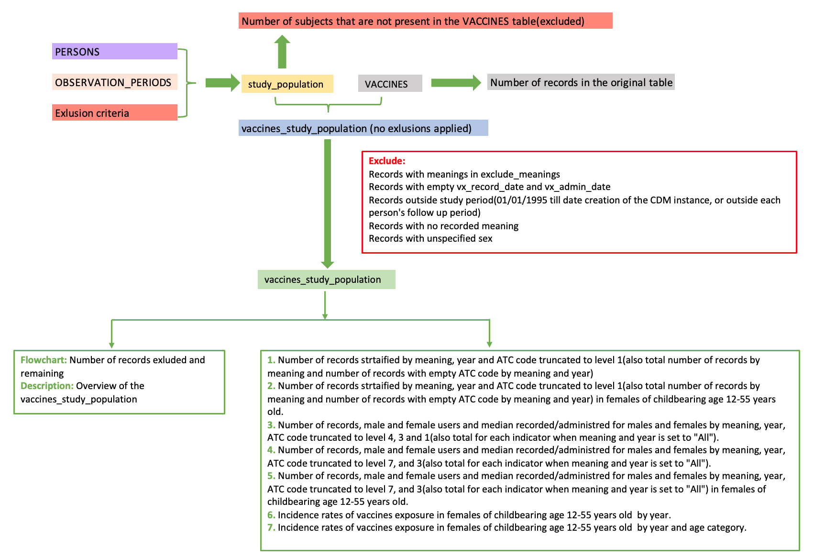

```{css,  echo = F}
/*-- Specify div's for 'boxes', change color of TOC and center align titles: --*/
div.box1 {background-color: #f5f5f0; border-radius: 5px; padding: 30px; margin-right: 0px}
div.box2 {background-color: #d4e5d2; border-radius: 5px; padding: 30px; margin-right: 0px}
div.box3 {border-style: solid; border-color: #f5f5f0; border-width: medium; border-radius: 30px; padding: 5px; margin-right: 0px}

.list-group-item.active, .list-group-item.active:focus, .list-group-item.active:hover {background-color: #76b82a; border-color: #76b82a}
h1 {text-align: center; color: #3c7b8a}
h2 {text-align: center; color: #76b82a}

/*-- Add logo (based on https://rstudio4edu.github.io/rstudio4edu-book/rmd-fancy.html): --*/
#TOC::before {content: ""; display: block; height: 60px; margin: 30px 10px 30px; background-image: url("conception_logo.png"); background-size: contain; background-position: center center; background-repeat: no-repeat}
```

```{r set_locale, include=FALSE}
Sys.setlocale("LC_ALL", "C")
`%!in%` = Negate(`%in%`)
```

```{r, echo=F, error=FALSE, include=FALSE}
parameter_file_fl<-list.files(paste0(projectFolder,"/p_parameters/"),"study_parameters")
parameter_file<-as.data.table(read_excel(paste0(projectFolder,"/p_parameters/",parameter_file_fl),col_types = "text", sheet = "study_parameters"))
#Set parameters basic parameters
vaccine_var <- parameter_file[variable=="vaccine_analysis",value]
```

```{r, echo=FALSE}
if(vaccine_var=="ATC"){var_to_keep<-"vx_atc"}
if(vaccine_var=="type"){var_to_keep<-"vx_type"}
if(vaccine_var=="both"){var_to_keep<-"vx_type"}
```

<div class = 'box1'>

**Level 3:** Vaccines exposure in the study population      

 - **Script directory:** `r projectFolder`
 - **Date/time:** `r Sys.time()`
 - **DAP:** `r data_access_provider_name`
 - **Data source:** `r data_source_name`
 - **Vaccine indicator:** `r var_to_keep`

</div>

<div class = 'box2'>

```{r time_log, echo=F}
if (subpopulations_present=="No"){
timelog_vacc<-fread(paste0(vacc_dir,"Time_log/", list.files(paste0(vacc_dir,"Time_log/"),"time_vaccines.csv")))
kable(timelog_vacc)
} else {
timelog_vacc<-fread(paste0(vacc_dir,subpopulations_names[a], "/Time_log/","time_vaccines.csv"))
kable(timelog_vacc)
}
```

</div>

<div class = 'box1'>

The analysis contains the following steps:

<br>



If subpopulations are available in your data the analysis will be performed separately for each subpopulation.
In case there is an overlapping subpopulation only subjects in the overlap period will be taken into account.
***Example:***

<br>


`year` is retrieved from `vx_record_date` or `vx_admin_date`. If both dates are present, `vx_admin_date` will be used.

</div>

<br>

<div class = 'box3'>

## 1. Rates of vaccine exposure


### Rates of vaccines exposure in the study population by year and ATC code

<br>

When subjects are being followed(i.e. they contribute to the person time in a particular year) but do not have a administrated/recorded vaccine, the truncated_atc_code variable will be set to N/A.

```{r rates_year, echo=F}
if (subpopulations_present=="No"){
  if(length(list.files(paste0(vacc_dir,"GDPR/"), pattern="vaccines_rates_year_atc_masked.csv"))>0){
tab15_vacc<-fread(paste0(vacc_dir,"GDPR/", list.files(paste0(vacc_dir,"GDPR/"), pattern="vaccines_rates_year_atc_masked.csv")))
if (tab15_vacc[,.N]>0){
  if (tab15_vacc[,.N]>12000){
        print("If the table contanins more than 12000 records it can not be displayed in the report. For the complete table, go to g_output/VACCINES/vaccines_rates_year_atc_GDPR.csv")
    datatable(head(tab15_vacc,12000), options = list(scrollX=T), filter = "top")
  } else {
datatable(tab15_vacc, options = list(scrollX=T), filter = "top")
  }
} else {
  tab15_vacc<-NULL
    print("This table cannot be produced based on the available data.")
}
  } else {
      tab15_vacc<-NULL
    print("This table cannot be produced based on the available data.")
}
} else {
    if(length(list.files(paste0(vacc_dir,subpopulations_names[a], "/GDPR/"), pattern="vaccines_rates_year_atc_masked.csv"))>0){
  tab15_vacc<-fread(paste0(vacc_dir,subpopulations_names[a], "/GDPR/", list.files(paste0(vacc_dir,subpopulations_names[a], "/GDPR/"), pattern="vaccines_rates_year_atc_masked.csv")))
  if (tab15_vacc[,.N]>0){
   if (tab15_vacc[,.N]>12000){   
            print("If the table contanins more than 12000 records it can not be displayed in the report. For the complete table, go to g_output/VACCINES/vaccines_rates_year_atc_GDPR.csv")
        datatable(head(tab15_vacc,12000), options = list(scrollX=T), filter = "top")
   } else {
datatable(tab15_vacc, options = list(scrollX=T), filter = "top")
   }
  } else {
      tab15_vacc<-NULL
      print("This table cannot be produced based on the available data.")
  }
    } else {
        tab15_vacc<-NULL
    print("This table cannot be produced based on the available data.")
    }
}
```

<br>


#### Graph: Rates of vaccines exposure by year and ATC code

```{r tab15_graph_vaccines_f, echo=FALSE, warning=FALSE}

if(!is.null(tab15_vacc)){
   tab15_graph_vacc<-tab15_vacc[,-c("no_records","no_users","no_subjects"),with=F]
 
    tab15_graph_vacc[,vaccines_per_100_py:=as.numeric(vaccines_per_100_py)]
    tab15_graph_vacc[,vaccines_per_100_py:=round(vaccines_per_100_py,1)]
ggplotly(ggplot(tab15_graph_vacc, aes(x = year, y = vaccines_per_100_py, group=truncated_atc_code)) +
                           geom_line(aes(color=truncated_atc_code)) +
                           geom_point(aes(color=truncated_atc_code)) + 
           facet_wrap(~sex)+
                               xlab("Year") +
                               ylab("Rate per 100 person-years")+
                             theme_classic() +
                             guides(shape = guide_legend(override.aes = list(size = 0.3))) +
                               theme(text=element_text(size=10),
                                 axis.text.x = element_text(angle = 90, hjust = 1),
                                     axis.title.x = element_text(colour = "#76b82a"),
                                     axis.title.y = element_text(colour = "#76b82a"),
                                     plot.title = element_text(colour = "#76b82a"),
                                     strip.text.y = element_text(angle = 0),
                                     legend.title = element_text(size = 7), 
               legend.text = element_text(size = 7))) 
                                     
  }else {
  print("This graph cannot be produced based on the available data.") 
  }
```


### Rates of vaccines exposure in the study population by year, age and ATC code

<br>

When subjects are being followed(i.e. they contribute to the person time in a particular year) but do not have a administrated/recorded vaccine, the `truncated_atc_code` variable will be set to N/A.

```{r rates_year_age, echo=F}
if (subpopulations_present=="No"){
  if(length(list.files(paste0(vacc_dir,"GDPR/"), pattern="vaccines_rates_year_age_atc_masked.csv"))>0){
tab16_vacc<-fread(paste0(vacc_dir,"GDPR/", list.files(paste0(vacc_dir,"GDPR/"), pattern="vaccines_rates_year_age_atc_masked.csv")))
if (tab16_vacc[,.N]>0){
  if (tab16_vacc[,.N]>12000){
print("If the table contanins more than 12000 records it can not be displayed in the report. For the complete table, go to g_output/VACCINES/vaccines_rates_year_age_atc_masked.csv")
datatable(head(tab16_vacc,12000), options = list(scrollX=T), filter = "top")
  } else {
datatable(tab16_vacc, options = list(scrollX=T), filter = "top")  
  }
} else {
    tab16_vacc<-NULL
    print("This table cannot be produced based on the available data.")
}
  } else {
    tab16_vacc<-NULL
    print("This table cannot be produced based on the available data.")
}
} else {
    if(length(list.files(paste0(vacc_dir,subpopulations_names[a], "/GDPR/"), pattern="vaccines_rates_by_year_age_atc_masked.csv"))>0){
  tab16_vacc<-fread(paste0(vacc_dir,subpopulations_names[a], "/GDPR/", list.files(paste0(vacc_dir,subpopulations_names[a], "/GDPR/"), pattern="vaccines_rates_by_year_age_atc_masked.csv")))
  if (tab16_vacc[,.N]>0){
    if(tab16_vacc[,.N]>12000){
      print("If the table contanins more than 12000 records it can not be displayed in the report. For the complete table, go to g_output/VACCINES/vaccines_rates_year_age_atc_masked.csv")
datatable(head(tab16_vacc,12000), options = list(scrollX=T), filter = "top")
    } else {
      datatable(tab16_vacc, options = list(scrollX=T), filter = "top")
    }
  } else {
    tab16_vacc<-NULL
      print("This table cannot be produced based on the available data.")
  }
    } else {
      tab16_vacc<-NULL
    print("This table cannot be produced based on the available data.")
    }
}
```


```{r tab16_graph_med_f, echo=FALSE, warning=FALSE}

if(!is.null(tab16_vacc)){
  tab16_graph_vacc<-tab16_vacc[,-c("no_records","no_users","no_subjects"),with=F]
    tab16_graph_vacc[,vaccines_per_100_py:=as.numeric(vaccines_per_100_py)]
    tab16_graph_vacc[,vaccines_per_100_py:=round(vaccines_per_100_py,1)]
fig.tab16_med_med_f<-vector(mode="list", length=length(unique(tab16_graph_vacc[,age_band])))
for(i in 1:length(unique(tab16_graph_vacc[,age_band]))){
fig.tab16_med_med_f[[i]]<-ggplotly(ggplot(tab16_graph_vacc[age_band==unique(tab16_graph_vacc[,age_band])[i]], aes(x = year, y = vaccines_per_100_py, group=truncated_atc_code)) +
                           geom_line(aes(color=truncated_atc_code)) +
                           geom_point(aes(color=truncated_atc_code)) + 
                             facet_wrap(~sex)+
                               ggtitle(paste0("Rate of vaccine exposure, age band:", unique(tab16_graph_vacc[,age_band])[i])) + 
                               xlab("Year") +
                               ylab("Rate per 100 person-years")+
                             theme_classic() +
                             guides(shape = guide_legend(override.aes = list(size = 0.3))) +
                               theme(text=element_text(size=10),
                                 axis.text.x = element_text(angle = 90, hjust = 1),
                                     axis.title.x = element_text(colour = "#76b82a"),
                                     axis.title.y = element_text(colour = "#76b82a"),
                                     plot.title = element_text(colour = "#76b82a"),
                                     strip.text.y = element_text(angle = 0),
                                     legend.title = element_text(size = 7),
                                 legend.text = element_text(size = 7)))
}
}else{
    fig.tab16_med_med_f<-NULL
  }
```

#### Graph: Rates of vaccines exposure in the study population by year, age and ATC code

```{r display_tab16_med_graph_f, echo=FALSE}
if(!is.null(tab16_vacc)){
  if(!is.null(fig.tab16_med_med_f)){
htmltools::tagList(list(fig.tab16_med_med_f))
} 
  } else {
  print("This table cannot be produced based on the available data.") 
}
```

</div>

<div class = 'box3'>


## 2. Calculations


```{r calculations_table, echo=FALSE}
calculations_vaccines<-data.table(rbind(
   cbind(indicator= "Rate of vaccines exposure by sex and year in the study population",           variable_name=c("no_records", "no_users","no_subjects","person_years"),
         stratifying_variable=c("vx_atc(truncated to three/four letters),sex and year",
                                "vx_atc(truncated to three/four letters),sex and year",
                                "sex and year",
                                "sex and year"),
         calculation=c("Number of records for a particular medicinal group in the study population by sex by year", "Number of users who are administrated/recorded a vaccine stratified by sex in a particular year", "Number of subjects who are present(i.e. contribute to the person time) stratified by sex in a particular year", "Follow up time by year and sex")),
   
  cbind(indicator= "Rate of vaccines exposure by sex, age band and year)",           variable_name=c("no_records", "no_users","no_subjects","person_years"),
         stratifying_variable=c("vx_atc(truncated to three/four letters),sex, age_band and year",
                                "vx_atc(truncated to three/four letters),sex, age_band and year",
                                "sex, year and age_band",
                                "sex,year and age_band"),
         calculation=c("Number of records for a particular medicinal group in the study population by sex, year and age_band", "Number of users in the study population who are administrated/recorded a vaccine by sex in a particular year and age_band", "Number of subjects in the study population who are present(i.e. contribute to the person time) by sex in a particular year and age_band", "Follow up time by sex, year and age_band"))))
datatable(calculations_vaccines, filter = "top")
```

</div>

<br>

<div class = 'box2'>

**Author:** Vjola Hoxhaj Drs.   
**email:** v.hoxhaj@umcutrecht.nl   
**Organisation:** UMC Utrecht, Utrecht, The Netherlands   

</div>
