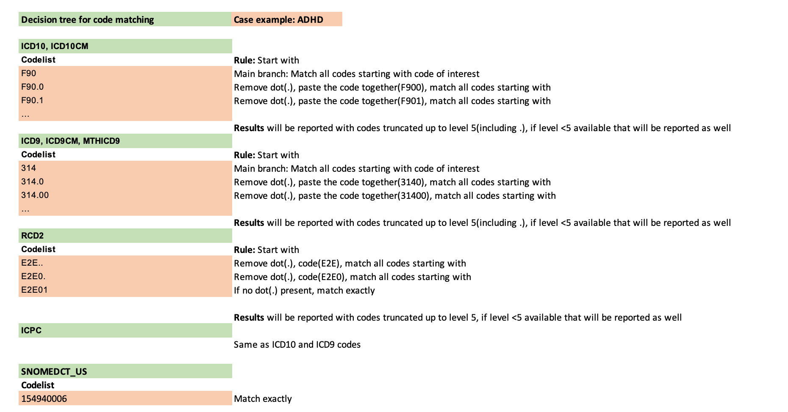
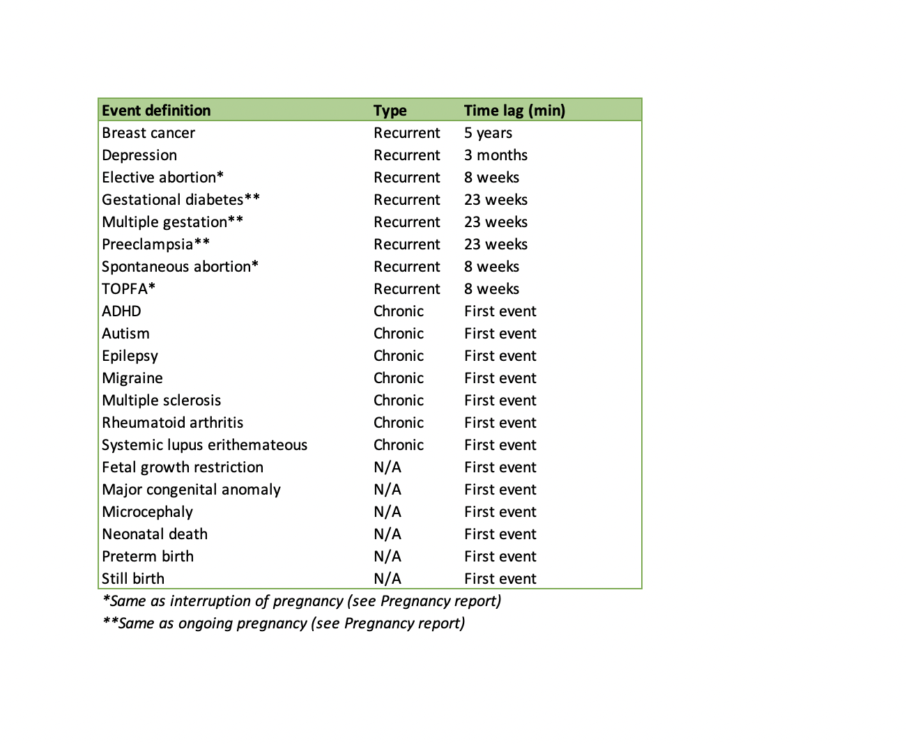

```{css,  echo = F}
/*-- Specify div's for 'boxes', change color of TOC and center align titles: --*/
div.box1 {background-color: #f5f5f0; border-radius: 5px; padding: 30px; margin-right: 0px}
div.box2 {background-color: #d4e5d2; border-radius: 5px; padding: 30px; margin-right: 0px}
div.box3 {border-style: solid; border-color: #f5f5f0; border-width: medium; border-radius: 30px; padding: 5px; margin-right: 0px}

.list-group-item.active, .list-group-item.active:focus, .list-group-item.active:hover {background-color: #76b82a; border-color: #76b82a}
h1 {text-align: center; color: #3c7b8a}
h2 {text-align: center; color: #76b82a}

/*-- Add logo (based on https://rstudio4edu.github.io/rstudio4edu-book/rmd-fancy.html): --*/
#TOC::before {content: ""; display: block; height: 60px; margin: 30px 10px 30px; background-image: url("conception_logo.png"); background-size: contain; background-position: center center; background-repeat: no-repeat}
```

```{r set_locale, include=FALSE}
Sys.setlocale("LC_ALL", "C")
`%!in%` = Negate(`%in%`)
```

```{r, echo=F,include=FALSE}
codelist_used<-list.files(paste0(pre_dir,"Codelists/"),"full_codelist")
```

<div class = 'box1'>

**Level 3:** Diagnoses counts and rates in the study population 

 - **Script directory:** `r projectFolder`
 - **Date/time:** `r Sys.time()`
 - **DAP:** `r data_access_provider_name`
 - **Data source:** `r data_source_name`
 - **Codelist version:** `r codelist_used`

</div>

<div class = 'box2'>
```{r time_log, echo=F}
if (subpopulations_present=="No"){
timelog_diag<-fread(paste0(diag_dir,"Time_log/", list.files(paste0(diag_dir,"Time_log/"),"time_diagnoses.csv")))
kable(timelog_diag)
} else {
timelog_diag<-fread(paste0(diag_dir,subpopulations_names[a], "/Time_log/","time_diagnoses.csv"))
kable(timelog_diag)
}
```
</div>

<div class = 'box1'>

The analysis contains the following steps:


The codelist algorithm is explained below:

<br>



<br>

Time lag between two diagnoses is as follows:

For chronic conditions and not applicable condition rates of first events only will be reported.   

<br>



<br>

If subpopulations are available in your data the analysis will be performed separately for each subpopulation.
In case there is an overlapping subpopulation only subjects in the overlap period will be taken into account.
***Example:***

<br>


`year` is retrieved from `start_date_record` for the **EVENTS** table, `mo_date` for the **MEDICAL_OBSERVATIONS** table and `so_date` for **SURVEY_OBSERVATIONS** table.

</div>

<br>

<div class = 'box1'>

Used parameters

```{r, echo=F,include=FALSE}
parameter_file_fl<-list.files(paste0(projectFolder,"/p_parameters/"),"study_parameters")
parameter_file<-as.data.table(read_excel(paste0(projectFolder,"/p_parameters/",parameter_file_fl),col_types = "text", sheet = "study_parameters"))
#Set parameters basic parameters
study_name <- parameter_file[variable=="study_name_codelist",value]
rec_ev <- parameter_file[variable=="recurrent_event_analysis",value]
info_start<-data.table(Indicator=c("Study name codelist",
                                   "Repeated event analysis"),
                       Value=c(study_name,
                               rec_ev))

```

```{r, echo=FALSE}
datatable(info_start)
```

</div>

<div class = 'box3'>


## 1. Flowchart
<br> 

```{r echo=F}
if (subpopulations_present=="No"){
flowchart_diagnoses<-fread(paste0(diag_dir,"Masked/", list.files(paste0(diag_dir,"Masked/"),"diagnoses_flowchart_masked.csv")))
datatable(flowchart_diagnoses, options = list(scrollX=T))
} else {
flowchart_diagnoses<-fread(paste0(diag_dir,subpopulations_names[a], "/Masked/",list.files(paste0(diag_dir,subpopulations_names[a], "/Masked/"),paste0(subpopulations_names[a],"_diagnoses_flowchart_masked.csv"))))
datatable(flowchart_diagnoses, options = list(scrollX=T))
}
```


</div>

<br>

<div class = 'box3'>

## 2. Description of diagnoses_study_population

<br> 

```{r echo=F}
if (subpopulations_present=="No"){
description_diagnoses<-fread(paste0(diag_dir,"Masked/", list.files(paste0(diag_dir, "Masked/"),"diagnoses_description_masked.csv")))
datatable(description_diagnoses, options = list(scrollX=T))
} else {
  description_diagnoses<-fread(paste0(diag_dir,subpopulations_names[a], "/Masked/",
                                list.files(paste0(diag_dir,subpopulations_names[a], "/Masked/"),paste0(subpopulations_names[a],"_diagnoses_description_masked.csv"))))
datatable(description_diagnoses, options = list(scrollX=T))
}
```

</div>

<br>

<div class = 'box3'>

## 3. Missingness of diagnostic codes

<br> 

```{r echo=F}
if (subpopulations_present=="No"){
  if(length(list.files(paste0(diag_dir,"Masked/"), pattern="diagnoses_completeness_masked.csv"))>0){
tab20_diag<-fread(paste0(diag_dir,"Masked/",list.files(paste0(diag_dir,"Masked/"), "diagnoses_completeness_masked.csv")))
if(tab20_diag[,.N]>0){
datatable(tab20_diag, options = list(scrollX=T))
  } else {
    tab20_diag<-NULL
  print("This table cannot be produced based on the available data.")
  }
} else {
  tab20_diag<-NULL
  print("This table cannot be produced based on the available data.")
}
} else {
    if(length(list.files(paste0(diag_dir,subpopulations_names[a], "/Masked/"), pattern="diagnoses_completeness_masked.csv"))>0){
    tab20_diag<-fread(paste0(diag_dir,subpopulations_names[a], "/Masked/",list.files(paste0(diag_dir,subpopulations_names[a], "/Masked/"), pattern="diagnoses_completeness_masked.csv")))
    if(tab20_diag[,.N]>0){
datatable(tab20_diag, options = list(scrollX=T))
    } else {
      tab20_diag<-NULL
    print("This table cannot be produced based on the available data.") 
    }
  } else {
    tab20_diag<-NULL
    print("This table cannot be produced based on the available data.")
  }
}
```

A count smaller than 5(counts between 1 and 4) will be represented in the graphs with a value of 3 for visualization. Counts of 0 are not plotted. If a category is missing in the plot, it means that it had a count of zero. 

```{r tab20_graph_diag, echo=F}
if(!is.null(tab20_diag)){
tab20_graph_diag<-tab20_diag[no_records=="<5", no_records:= 3]
tab20_graph_diag<-tab20_graph_diag[,no_records:=as.numeric(no_records)]
tab20_graph_diag<-tab20_graph_diag[no_empty_code=="<5", no_empty_code:= 3]
tab20_graph_diag<-tab20_graph_diag[,no_empty_code:=as.numeric(no_empty_code)]
tab20_graph_diag<-tab20_graph_diag[no_empty_code!=0]
tab20_graph_diag<-tab20_graph_diag[,year:=as.factor(year)]
#recalculate the percentage
tab20_graph_diag[,percentage_empty_code:=round((no_empty_code/no_records)*100,2)]
} else {
 tab20_graph_diag<-NULL 
}


if(!is.null(tab20_diag)){
# Compute the cumulative percentages (top of each rectangle)
  if(tab20_graph_diag[,.N]>0){
ggplot(tab20_graph_diag, aes(fill=year, y=percentage_empty_code, x=meaning, label= percentage_empty_code)) + 
  geom_bar(position="stack", stat="identity") +
  geom_text(size=3, position=position_stack(vjust=0.5)) +
    ggtitle("Diagoses completeness information") +
    xlab("") + 
  ylab("Percentage") +
  theme(axis.text.y = element_blank(),
        axis.ticks.y = element_blank(),
        axis.text.x=element_text(angle = 90),
        plot.title = element_text(color="#76b82a", face="bold"))
  } else {
    print("There are no records with empty codes so the graph is not displayed.")
  }
} else {
    print("This table cannot be produced based on the available data.")
  }

```
<br>

</div>

<br>

<div class = 'box3'>

## 4. Codelist: Event definition

<br> 

```{r echo=F}
codes<-fread(paste0(output_dir,"Info/","data_characterisation_codelist.csv"))
datatable(codes, options = list(scrollX=T))
```

</div>

<br>

<div class = 'box3'>

## 5. Calculations

```{r calculations_table, echo=FALSE}
calculations_diagnoses<-data.table(rbind(
   cbind(indicator= "Missingness of diagnotic codes",
          variable_name=c("no_records", "no_empty_code"),
         stratifying_variable=c("meaning of record and year", "meaning of record and year"),
         calculation=c("Number of records stratified by the meaning of the record and year", "Number of records with empty event code stratified by the meaning of the record and year")),
  
   cbind(indicator= "Code count by meaning and event definition",           
         variable_name=c("no_records", "total_records"),
         stratifying_variable=c("truncated_code(truncated event code up to 4 digits for vocabularies ICD,MTHICD,ICPC,RCD otherwise the original code is used), vocabulary, event_definition, meaning of record and year",
                                "event_definition"),
         calculation=c("Number of records for a particular event code in a particular event vocabulary stratified by the event definition, meaning of the record and year",
                       "Total number of records for an event definition")),
  cbind(indicator= "Rate of recurrent events by sex, age band and year)",           
        variable_name=c("no_records", "person_years", "rate_per_100_py"),
         stratifying_variable=c("event_definition, sex, age_band and year",
                                "sex, age_band and year",
                                "event_definition, sex, age_band and year"),
         calculation=c("Number of records for a particular event definition in the study population by sex, year and age_band", "Follow up time by sex, year and age_band(if an event has a lag time the specified lag time is removed after each event and if an event doesn't have a lag time then no person time is removed)", "Calculated by dividing no_records with person time, multiply by 100 and round to 2 digits")),
    cbind(indicator= "Rate of recurrent events by sex and year)",           
        variable_name=c("no_records", "person_years","rate_per_100_py"),
         stratifying_variable=c("event_definition, sex and year",
                                "sex and year",
                                "event_definition, sex and year"),
         calculation=c("Number of records for a particular event definition in the study population by sex and year", "Follow up time by sex and year(if an event has a lag time the specified lag time is removed after each event and if an event doesn't have a lag time then no person time is removed)", "Calculated by dividing no_records with person time, multiply by 100 and round to 2 digits")),
      cbind(indicator= "Rate of recurrent events by year)",           
        variable_name=c("no_records", "person_years","rate_per_100_py"),
         stratifying_variable=c("event_definition and year",
                                "year",
                                "event_definition and year"),
         calculation=c("Number of records for a particular event definition in the study population year", "Follow up time by year(if an event has a lag time the specified lag time is removed after each event and if an event doesn't have a lag time then no person time is removed)", "Calculated by dividing no_records with person time, multiply by 100 and round to 2 digits")),
  cbind(indicator= "Rate of first event by sex, age band and year)",           
        variable_name=c("no_records", "person_years", "rate_per_100_py"),
         stratifying_variable=c("event_definition, sex, age_band and year",
                                "sex, age_band and year",
                                "event_definition, sex, age_band and year"),
        calculation=c("Number of records for a particular event definition in the study population(only first event is being counted and then the person is being censored) by sex, year and age_band", "Follow up time by sex, year and age_band(A person is censored at first event and follow up time is cut at event date, if no event occurs the person contributes fully to the person time)", "Calculated by dividing no_records with person time, multiply by 100 and round to 2 digits")),
  cbind(indicator= "Rate of first event by sex and year)",           
        variable_name=c("no_records", "person_years", "rate_per_100_py"),
         stratifying_variable=c("event_definition, sex and year",
                                "sex and year",
                                "event_definition, sex and year"),
        calculation=c("Number of records for a particular event definition in the study population(only first event is being counted and then the person is being censored) by sex and year", "Follow up time by sex and year(A person is censored at first event and follow up time is cut at event date, if no event occurs the person contributes fully to the person time)", "Calculated by dividing no_records with person time, multiply by 100 and round to 2 digits")),
    cbind(indicator= "Rate of first event by year)",           
        variable_name=c("no_records", "person_years", "rate_per_100_py"),
         stratifying_variable=c("event_definition and year",
                                "year",
                                "event_definition and year"),
        calculation=c("Number of records for a particular event definition in the study population(only first event is being counted and then the person is being censored) by year", "Follow up time by year(A person is censored at first event and follow up time is cut at event date, if no event occurs the person contributes fully to the person time)", "Calculated by dividing no_records with person time, multiply by 100 and round to 2 digits"))))
datatable(calculations_diagnoses)
```

</div>

<br>

<div class = 'box3'>

## 6. References

<br>

**1.** Alessandri, M., Thorp, D., Mundy, P., & Tuchman, R. F. (2005). [Can we cure autism? From outcome to intervention]. Revista De Neurologia.    
**2.** A. T. F. (2013). Recurrence of major depressive disorder across different treatment settings: Results from the NESDA study. Journal of Affective Disorders, 147(1), 225–231.    
**3.** Bullock, J., Rizvi, S. A. A., Saleh, A. M., Ahmed, S. S., Do, D. P., Ansari, R. A., & Ahmed, J. (2018). Rheumatoid Arthritis: A Brief Overview of the Treatment. Medical Principles and Practice, 27(6), 501–507.    
**4.** Gohil, K. (2015). Multiple Sclerosis: Progress, but No Cure. P & T.: A Peer-Reviewed Journal for Formulary Management, 40(9), 604–605.    
**5.** Hardeveld, F., Spijker, J., Graaf, R. D., Hendriks, S. M., Licht, C. M. M., Nolen, W. A., Penninx, B. W.J.H., Beekman, A. T. F. (2013). Recurrence of major depressive disorder across different treatment settings: Results from the NESDA study. Journal of Affective Disorders, 147(1), 225–231.    
**6.** Kalra, A. A., & Elliott, D. (2007). Acute migraine: Current treatment and emerging therapies. Therapeutics and Clinical Risk Management, 3(3), 449–459.    
**7.** Klein, P., & Tyrlikova, I. (2020). No prevention or cure of epilepsy as yet. Neuropharmacology, 168, 107762.    
**8.** Matcho, A., Ryan, P., Fife, D., Gifkins, D., Knoll, C., & Friedman, A. (2018). Inferring pregnancy episodes and outcomes within a network of observational databases. PLOS ONE, 13(2).    
**9.** Rosario, C., Seguro, L., Vasconcelos, C., & Shoenfeld, Y. (2013). Is there a cure for systemic lupus erythematosus. Lupus, 22(5), 417–421.    
**10.** Wilens, T. E., & Spencer, T. J. (2010). Understanding Attention-Deficit/Hyperactivity Disorder from Childhood to Adulthood. Postgraduate Medicine, 122(5), 97–109.     

</div>

<div class = 'box2'>

Author: Vjola Hoxhaj Drs.   
email: v.hoxhaj@umcutrecht.nl   
Organisation: UMC Utrecht, Utrecht, The Netherlands    

</div>
