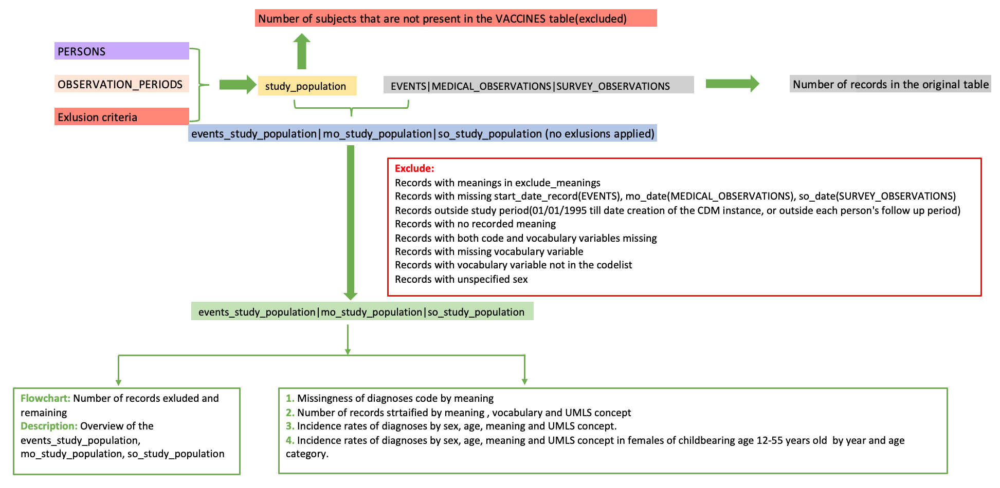
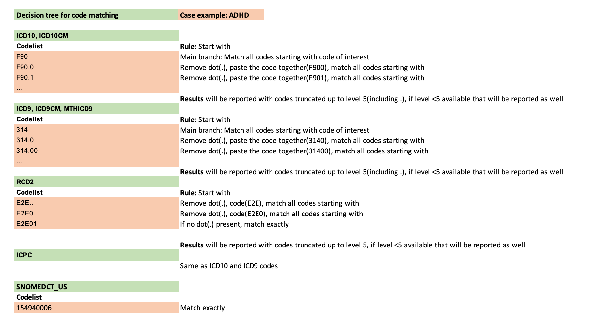
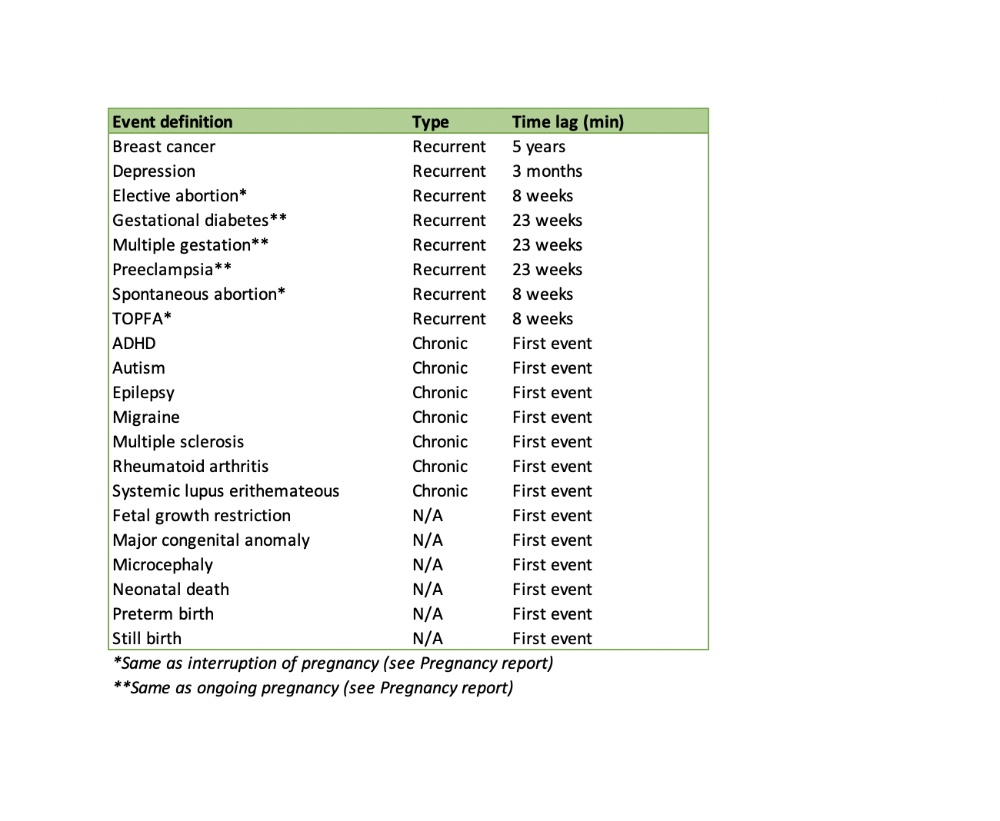

```{css,  echo = F}
/*-- Specify div's for 'boxes', change color of TOC and center align titles: --*/
div.box1 {background-color: #f5f5f0; border-radius: 5px; padding: 30px; margin-right: 0px}
div.box2 {background-color: #d4e5d2; border-radius: 5px; padding: 30px; margin-right: 0px}
div.box3 {border-style: solid; border-color: #f5f5f0; border-width: medium; border-radius: 30px; padding: 5px; margin-right: 0px}

.list-group-item.active, .list-group-item.active:focus, .list-group-item.active:hover {background-color: #76b82a; border-color: #76b82a}
h1 {text-align: center; color: #3c7b8a}
h2 {text-align: center; color: #76b82a}

/*-- Add logo (based on https://rstudio4edu.github.io/rstudio4edu-book/rmd-fancy.html): --*/
#TOC::before {content: ""; display: block; height: 60px; margin: 30px 10px 30px; background-image: url("conception_logo.png"); background-size: contain; background-position: center center; background-repeat: no-repeat}
```

```{r set_locale, include=FALSE}
Sys.setlocale("LC_ALL", "C")
`%!in%` = Negate(`%in%`)
```

```{r, echo=F, include=FALSE}
codelist_used<-list.files(paste0(pre_dir,"Codelists/"),"full_codelist")
```

<div class = 'box1'>

**Level 3:** Diagnoses counts and rates in the study population 

 - **Script directory:** `r projectFolder`
 - **Date/time:** `r Sys.time()`
 - **DAP:** `r data_access_provider_name`
 - **Data source:** `r data_source_name`
 - **Codelist version:** `r codelist_used`

</div>

<div class = 'box2'> 
```{r time_log, echo=F}
if (subpopulations_present=="No"){
timelog_diag<-fread(paste0(diag_dir,"Time_log/", list.files(paste0(diag_dir,"Time_log/"),"time_diagnoses.csv")))
kable(timelog_diag)
} else {
timelog_diag<-fread(paste0(diag_dir,subpopulations_names[a], "/Time_log/","time_diagnoses.csv"))
kable(timelog_diag)
}
```
</div>

<div class = 'box1'> 
The analysis contains the following steps:


The codelist algorithm is explained below:

<br>



<br>

Time lag between two diagnoses is as follows:

For chronic conditions and not applicable condition rates of first events only will be reported.   

<br>



<br>

If subpopulations are available in your data the analysis will be performed separately for each subpopulation.
In case there is an overlapping subpopulation only subjects in the overlap period will be taken into account.
***Example:***

<br>


`year` is retrieved from `start_date_record` for the **EVENTS** table, `mo_date` for the **MEDICAL_OBSERVATIONS** table and `so_date` for **SURVEY_OBSERVATIONS** table.

</div>

<br>

<div class = 'box1'>

Used parameters

```{r, echo=F,include=FALSE}
parameter_file_fl<-list.files(paste0(projectFolder,"/p_parameters/"),"study_parameters")
parameter_file<-as.data.table(read_excel(paste0(projectFolder,"/p_parameters/",parameter_file_fl),col_types = "text", sheet = "study_parameters"))
#Set parameters basic parameters
study_name <- parameter_file[variable=="study_name_codelist",value]
rec_ev <- parameter_file[variable=="recurrent_event_analysis",value]
info_start<-data.table(Indicator=c("Study name codelist",
                                   "Repeated event analysis"),
                       Value=c(study_name,
                               rec_ev))

```

```{r, echo=FALSE}
datatable(info_start)
```

</div>

<div class = 'box3'>

**Data cleanup**

<mark style="background-color: #d4e5d2"> All diagnoses records with the same date of event are removed. All duplicated records and records within the time lag(for recurrent events) are discarded. The removed number of rows is displayed below.</mark>

```{r removed_subjects, echo=F}

if (subpopulations_present=="No"){
  if(length(list.files(diag_dir, pattern="diagnoses_remove_duplicated_diagoses.csv"))>0){
    removed_duplicates<-fread(paste0(diag_dir,list.files(diag_dir, pattern="diagnoses_remove_duplicated_diagoses.csv")))
    
    datatable(removed_duplicates, options = list(scrollX=T))
  }
} else {
 if(length(list.files(paste0(diag_dir,subpopulations_names[a], "/"), pattern="diagnoses_remove_duplicated_diagoses.csv"))>0){
 removed_duplicates<-fread(paste0(diag_dir,subpopulations_names[a],"/", list.files(paste0(diag_dir,subpopulations_names[a], "/"), pattern="diagnoses_remove_duplicated_diagoses.csv")))
 
  datatable(removed_duplicates, options = list(scrollX=T))
   }}
```


<mark style="background-color: #d4e5d2"> All records that are removed due to exclusion criteria mentioned in the flowchart are displayed below.</mark>

```{r excluded_subjects, echo=F}

if (subpopulations_present=="No"){
  if(length(list.files(diag_dir, pattern="excluded_people_diagoses.csv"))>0){
    removed_exclusion<-fread(paste0(diag_dir,list.files(diag_dir, pattern="excluded_people_diagoses.csv")))
    
    datatable(removed_exclusion, options = list(scrollX=T))
  }
} else {
 if(length(list.files(paste0(diag_dir,subpopulations_names[a], "/"), pattern="excluded_people_diagoses.csv"))>0){
 removed_exclusion<-fread(paste0(diag_dir,subpopulations_names[a],"/", list.files(paste0(diag_dir,subpopulations_names[a], "/"), pattern="excluded_people_diagoses.csv")))
 
  datatable(removed_exclusion, options = list(scrollX=T))
   }}
```


## 1. Rates of recurrent events

<mark style="background-color: #d4e5d2"> Lag time will be removed for all events of interest presented above, otherwise a first event analysis will be performed.</mark>  

<br>

#### Rates of recurrent events by year, sex and age band

<mark style="background-color: #d4e5d2">Person years are calculated as the observed period for each subject of the study population stratified by sex, age and year of observation.</mark>      
Follow up time is calculated by adding the following observation periods: 
  *people present in the study population but not in the diagnoses_study_population(contribute fully, end_follow_up-start_follow_up)      
  *people having a diagnoses different from the diagnoses of interest(contribute fully, end_follow_up-start_follow_up)
    *people having  the diagnoses of interest(contribute partially/fully, end_follow_up-start_follow_up, time lag removal for diagnoses with a time lag)
  

Incidence rates of zero will not be shown in the table but will be shown in the graphs.  
```{r rates_yas_recurrent, echo=F, warning=FALSE}
if (subpopulations_present=="No"){
  if(length(list.files(paste0(diag_dir,"Masked/"), pattern="diagnoses_rates_yas_recurrent_masked.csv"))>0){
rates_yas_rec<-fread(paste0(diag_dir,"Masked/", list.files(paste0(diag_dir,"Masked/"), pattern="diagnoses_rates_yas_recurrent_masked.csv")))
setcolorder(rates_yas_rec, c("event_definition","sex","age_band","year","no_records","person_years","rate_per_100_py"))
if (rates_yas_rec[,.N]>0){
  if (rates_yas_rec[,.N]>12000){
        print("If the table contanins more than 12000 records it can not be displayed in the report. For the complete table, go to g_output/DIAGNOSES/diagnoses_rates_yas_recurrent_masked.csv")
    datatable(head(rates_yas_rec[no_records!=0],12000), options = list(scrollX=T))
  } else {
datatable(rates_yas_rec[no_records!=0], options = list(scrollX=T))
  }
} else {
  rates_yas_rec<-NULL
    print("This table cannot be produced based on the available data or this analysis was not performed.")
}
  } else {
      rates_yas_rec<-NULL
    print("This table cannot be produced based on the available data or this analysis was not performed.")
}
} else {
    if(length(list.files(paste0(diag_dir,subpopulations_names[a], "/Masked/"), pattern="diagnoses_rates_yas_recurrent_masked.csv"))>0){
  rates_yas_rec<-fread(paste0(diag_dir,subpopulations_names[a], "/Masked/", list.files(paste0(diag_dir,subpopulations_names[a], "/Masked/"), pattern="diagnoses_rates_yas_recurrent_masked.csv")))
  setcolorder(rates_yas_rec, c("event_definition","sex","age_band","year","no_records","person_years","rate_per_100_py"))
  if (rates_yas_rec[,.N]>0){
   if (rates_yas_rec[,.N]>12000){   
            print("If the table contanins more than 12000 records it can not be displayed in the report. For the complete table, go to g_output/DIAGNOSES/diagnoses_rates_yas_recurrent_masked.csv")
        datatable(head(rates_yas_rec[no_records!=0],12000), options = list(scrollX=T))
   } else {
datatable(rates_yas_rec[no_records!=0], options = list(scrollX=T))
   }
  } else {
      rates_yas_rec<-NULL
      print("This table cannot be produced based on the available data or this analysis was not performed.")
  }
    } else {
        rates_yas_rec<-NULL
    print("This table cannot be produced based on the available data or this analysis was not performed.")
    }
}
```

<br>

Counts smaller than 5 will be replaced with a count of 3. Then the approximate incidence rates will be calculated as the variable of interest divided by the person years and multiplied by 100. The incidence is shown for all age bands.         

```{r rates_yas_rec_graph, echo=FALSE, warning=FALSE}
if(!is.null(rates_yas_rec)){
rates_yas_rec_graph<-rates_yas_rec[no_records=="<5", no_records:= 3]
rates_yas_rec_graph<-rates_yas_rec_graph[,no_records:=as.numeric(no_records)]
rates_yas_rec_graph<-rates_yas_rec_graph[person_years=="<5", person_years:= 3]
rates_yas_rec_graph<-rates_yas_rec_graph[,person_years:=as.numeric(person_years)]
rates_yas_rec_graph<-rates_yas_rec_graph[,year:=as.factor(year)]
rates_yas_rec_graph<-rates_yas_rec_graph[rate_per_100_py=="N/A", rate_per_100_py:= round((no_records/person_years)*100,2)]
} else {
 rates_yas_rec_graph<-NULL 
}

if(!is.null(rates_yas_rec_graph)){
  fig.rec_yas<-vector(mode="list", length=length(unique(rates_yas_rec_graph[,age_band])))
for(i in 1:length(unique(rates_yas_rec_graph[,age_band]))){
rates_yas_rec_graph[age_band==unique(rates_yas_rec_graph[,age_band])[i]][,event_definition:=gsub(" ","- \n", event_definition)] 
fig.rec_yas[[i]]<-ggplotly(ggplot(rates_yas_rec_graph[age_band==unique(rates_yas_rec_graph[,age_band])[i]], aes(x = year, y = rate_per_100_py, group=event_definition)) +
                           geom_line(aes(color=event_definition)) +
                           geom_point(aes(color=event_definition)) + 
                            facet_wrap(~ sex) +
                               ggtitle(paste0("Rate of diagnoses by sex, age and year in the study population:", unique(rates_yas_rec_graph[,age_band])[i])) + 
                               xlab("Year") +
                               ylab("Rate per 100 person-years")+
                             theme_classic() +
                             guides(shape = guide_legend(override.aes = list(size = 0.3))) +
                               theme(text=element_text(size=10),
                                 axis.text.x = element_text(angle = 90, hjust = 1),
                                     axis.title.x = element_text(colour = "#76b82a"),
                                     axis.title.y = element_text(colour = "#76b82a"),
                                     plot.title = element_text(colour = "#76b82a"),
                                     strip.text.y = element_text(angle = 0),
                                     legend.title = element_text(size = 6),
               legend.text = element_text(size = 6))) 
                                     
} 
  }
```

```{r display_rec_yas, echo=FALSE}
if(!is.null(rates_yas_rec)){
htmltools::tagList(list(fig.rec_yas))
} else {
  print("This table cannot be produced based on the available data.") 
}
```

<br>

#### Rates of recurrent events by year and sex

Incidence rates of zero will not be shown in the table but will be shown in the graphs.  

```{r rates_ys_recurrent, echo=F, warning=FALSE}
if (subpopulations_present=="No"){
  if(length(list.files(paste0(diag_dir,"Masked/"), pattern="diagnoses_rates_ys_recurrent_masked.csv"))>0){
rates_ys_rec<-fread(paste0(diag_dir,"Masked/", list.files(paste0(diag_dir,"Masked/"), pattern="diagnoses_rates_ys_recurrent_masked.csv")))
setcolorder(rates_ys_rec, c("event_definition","sex","year","no_records","person_years","rate_per_100_py"))
if (rates_ys_rec[,.N]>0){
  if (rates_ys_rec[,.N]>12000){
        print("If the table contanins more than 12000 records it can not be displayed in the report. For the complete table, go to g_output/DIAGNOSES/diagnoses_rates_ys_recurrent_masked.csv")
    datatable(head(rates_ys_rec[no_records!=0],12000), options = list(scrollX=T))
  } else {
datatable(rates_ys_rec[no_records!=0], options = list(scrollX=T))
  }
} else {
  rates_ys_rec<-NULL
    print("This table cannot be produced based on the available data or this analysis was not performed.")
}
  } else {
      rates_ys_rec<-NULL
    print("This table cannot be produced based on the available data or this analysis was not performed.")
}
} else {
    if(length(list.files(paste0(diag_dir,subpopulations_names[a], "/Masked/"), pattern="diagnoses_rates_ys_recurrent_masked.csv"))>0){
  rates_ys_rec<-fread(paste0(diag_dir,subpopulations_names[a], "/Masked/", list.files(paste0(diag_dir,subpopulations_names[a], "/Masked/"), pattern="diagnoses_rates_ys_recurrent_masked.csv")))
  setcolorder(rates_ys_rec, c("event_definition","sex","year","no_records","person_years","rate_per_100_py"))
  if (rates_ys_rec[,.N]>0){
   if (rates_ys_rec[,.N]>12000){   
            print("If the table contanins more than 12000 records it can not be displayed in the report. For the complete table, go to g_output/DIAGNOSES/diagnoses_rates_ys_recurrent_masked.csv")
        datatable(head(rates_ys_rec[no_records!=0],12000), options = list(scrollX=T))
   } else {
datatable(rates_ys_rec[no_records!=0], options = list(scrollX=T))
   }
  } else {
      rates_ys_rec<-NULL
      print("This table cannot be produced based on the available data or this analysis was not performed.")
  }
    } else {
        rates_ys_rec<-NULL
    print("This table cannot be produced based on the available data or this analysis was not performed.")
    }
}
```

<br>

Counts smaller than 5 will be replaced with a count of 3. Then the approximate incidence rates will be calculated as the variable of interest divided by the person years and multiplied by 100. The incidence is shown for all age bands.         

```{r rates_ys_rec_graph, echo=FALSE, warning=FALSE}
if(!is.null(rates_ys_rec)){
rates_ys_rec_graph<-rates_ys_rec[no_records=="<5", no_records:= 3]
rates_ys_rec_graph<-rates_ys_rec_graph[,no_records:=as.numeric(no_records)]
rates_ys_rec_graph<-rates_ys_rec_graph[person_years=="<5", person_years:= 3]
rates_ys_rec_graph<-rates_ys_rec_graph[,person_years:=as.numeric(person_years)]
rates_ys_rec_graph<-rates_ys_rec_graph[,year:=as.factor(year)]
rates_ys_rec_graph<-rates_ys_rec_graph[rate_per_100_py=="N/A", rate_per_100_py:= round((no_records/person_years)*100,2)]
} else {
 rates_ys_rec_graph<-NULL 
}

if(!is.null(rates_ys_rec_graph)){
rates_ys_rec_graph[,event_definition:=gsub(" ","- \n", event_definition)] 
ggplotly(ggplot(rates_ys_rec_graph, aes(x = year, y = rate_per_100_py, group=event_definition)) +
                           geom_line(aes(color=event_definition)) +
                           geom_point(aes(color=event_definition)) + 
                            facet_wrap(~ sex) +
                               ggtitle("Rate of diagnoses by sex and year in the study population") + 
                               xlab("Year") +
                               ylab("Rate per 100 person-years")+
                             theme_classic() +
                             guides(shape = guide_legend(override.aes = list(size = 0.3))) +
                               theme(text=element_text(size=10),
                                 axis.text.x = element_text(angle = 90, hjust = 1),
                                     axis.title.x = element_text(colour = "#76b82a"),
                                     axis.title.y = element_text(colour = "#76b82a"),
                                     plot.title = element_text(colour = "#76b82a"),
                                     strip.text.y = element_text(angle = 0),
                                     legend.title = element_text(size = 6),
               legend.text = element_text(size = 6))) 
                                     
} 
```

<br>

#### Rates of recurrent events by year 

Incidence rates of zero will not be shown in the table but will be shown in the graphs.  

```{r rates_y_recurrent, echo=F, warning=FALSE}
if (subpopulations_present=="No"){
  if(length(list.files(paste0(diag_dir,"Masked/"), pattern="diagnoses_rates_y_recurrent_masked.csv"))>0){
rates_y_rec<-fread(paste0(diag_dir,"Masked/", list.files(paste0(diag_dir,"Masked/"), pattern="diagnoses_rates_y_recurrent_masked.csv")))
setcolorder(rates_y_rec, c("event_definition","year","no_records","person_years","rate_per_100_py"))
if (rates_y_rec[,.N]>0){
  if (rates_y_rec[,.N]>12000){
        print("If the table contanins more than 12000 records it can not be displayed in the report. For the complete table, go to g_output/DIAGNOSES/diagnoses_rates_y_recurrent_masked.csv")
    datatable(head(rates_y_rec[no_records!=0],12000), options = list(scrollX=T))
  } else {
datatable(rates_y_rec[no_records!=0], options = list(scrollX=T))
  }
} else {
  rates_y_rec<-NULL
    print("This table cannot be produced based on the available data or this analysis was not performed.")
}
  } else {
      rates_y_rec<-NULL
    print("This table cannot be produced based on the available data or this analysis was not performed.")
}
} else {
    if(length(list.files(paste0(diag_dir,subpopulations_names[a], "/Masked/"), pattern="diagnoses_rates_y_recurrent_masked.csv"))>0){
  rates_y_rec<-fread(paste0(diag_dir,subpopulations_names[a], "/Masked/", list.files(paste0(diag_dir,subpopulations_names[a], "/Masked/"), pattern="diagnoses_rates_y_recurrent_masked.csv")))
  setcolorder(rates_y_rec, c("event_definition","year","no_records","person_years","rate_per_100_py"))
  if (rates_y_rec[,.N]>0){
   if (rates_y_rec[,.N]>12000){   
            print("If the table contanins more than 12000 records it can not be displayed in the report. For the complete table, go to g_output/DIAGNOSES/diagnoses_rates_y_recurrent_masked.csv")
        datatable(head(rates_y_rec[no_records!=0],12000), options = list(scrollX=T))
   } else {
datatable(rates_y_rec[no_records!=0], options = list(scrollX=T))
   }
  } else {
      rates_y_rec<-NULL
      print("This table cannot be produced based on the available data or this analysis was not performed.")
  }
    } else {
        rates_y_rec<-NULL
    print("This table cannot be produced based on the available data or this analysis was not performed.")
    }
}
```

<br>

Counts smaller than 5 will be replaced with a count of 3. Then the approximate incidence rates will be calculated as the variable of interest divided by the person years and multiplied by 100. The incidence is shown for all age bands.         

```{r rates_y_rec_graph, echo=FALSE, warning=FALSE}
if(!is.null(rates_ys_rec)){
rates_y_rec_graph<-rates_y_rec[no_records=="<5", no_records:= 3]
rates_y_rec_graph<-rates_y_rec_graph[,no_records:=as.numeric(no_records)]
rates_y_rec_graph<-rates_y_rec_graph[person_years=="<5", person_years:= 3]
rates_y_rec_graph<-rates_y_rec_graph[,person_years:=as.numeric(person_years)]
rates_y_rec_graph<-rates_y_rec_graph[,year:=as.factor(year)]
rates_y_rec_graph<-rates_y_rec_graph[rate_per_100_py=="N/A", rate_per_100_py:= round((no_records/person_years)*100,2)]
} else {
 rates_y_rec_graph<-NULL 
}

if(!is.null(rates_y_rec_graph)){
rates_y_rec_graph[,event_definition:=gsub(" ","- \n", event_definition)] 
ggplotly(ggplot(rates_y_rec_graph, aes(x = year, y = rate_per_100_py, group=event_definition)) +
                           geom_line(aes(color=event_definition)) +
                           geom_point(aes(color=event_definition)) + 
                               ggtitle("Rate of diagnoses by year in the study population") + 
                               xlab("Year") +
                               ylab("Rate per 100 person-years")+
                             theme_classic() +
                             guides(shape = guide_legend(override.aes = list(size = 0.3))) +
                               theme(text=element_text(size=10),
                                 axis.text.x = element_text(angle = 90, hjust = 1),
                                     axis.title.x = element_text(colour = "#76b82a"),
                                     axis.title.y = element_text(colour = "#76b82a"),
                                     plot.title = element_text(colour = "#76b82a"),
                                     strip.text.y = element_text(angle = 0),
                                     legend.title = element_text(size = 6),
               legend.text = element_text(size = 6))) 
                                     
} 
```


</div>

<br>

<div class = 'box3'>

## 2. Rates of first event

<mark style="background-color: #d4e5d2"> All subjects that had an event before start follow up are removed(separately for each event). The removed number of rows is displayed below.</mark>    

```{r removed_prior, echo=F}

if (subpopulations_present=="No"){
  if(length(list.files(diag_dir, pattern="diagnoses_remove_subj_prior_events.csv"))>0){
    removed_prior<-fread(paste0(diag_dir,list.files(diag_dir, pattern="diagnoses_remove_subj_prior_events.csv")))
    
    datatable(removed_prior, options = list(scrollX=T))
  }
} else {
 if(length(list.files(paste0(diag_dir,subpopulations_names[a], "/"), pattern="diagnoses_remove_subj_prior_events.csv"))>0){
 removed_prior<-fread(paste0(diag_dir,subpopulations_names[a],"/", list.files(paste0(diag_dir,subpopulations_names[a], "/"), pattern="diagnoses_remove_subj_prior_events.csv")))
 
  datatable(removed_prior, options = list(scrollX=T))
   }}
```

#### Rates of first event by year, sex and age band

<mark style="background-color: #d4e5d2"> Person years are calculated as the observed period for each subject of the study population stratified by sex, age and year of observation.</mark>     
Follow up time is calculated by adding the following observation periods: 
  *people present in the study population but not in the diagnoses_study_population(contribute fully, end_follow_up-start_follow_up)      
  *people having a diagnoses different from the diagnoses of interest(contribute fully, end_follow_up-start_follow_up)
    *people having  the diagnoses of interest(contribute partially, person time is censored at date of first event)
  

Incidence rates of zero will not be shown in the table but will be shown in the graphs.  

```{r rates_yas_first, echo=F, warning=FALSE}
if (subpopulations_present=="No"){
  if(length(list.files(paste0(diag_dir,"Masked/"), pattern="diagnoses_rates_yas_first_masked.csv"))>0){
rates_yas_first<-fread(paste0(diag_dir,"Masked/", list.files(paste0(diag_dir,"Masked/"), pattern="diagnoses_rates_yas_first_masked.csv")))
setcolorder(rates_yas_first, c("event_definition","sex","age_band","year","no_records","person_years","rate_per_100_py"))
if (rates_yas_first[,.N]>0){
  if (rates_yas_first[,.N]>12000){
        print("If the table contanins more than 12000 records it can not be displayed in the report. For the complete table, go to g_output/DIAGNOSES/diagnoses_rates_yas_first_masked.csv")
    datatable(head(rates_yas_first[no_records!=0],12000), options = list(scrollX=T))
  } else {
datatable(rates_yas_first[no_records!=0], options = list(scrollX=T))
  }
} else {
  rates_yas_first<-NULL
    print("This table cannot be produced based on the available data or this analysis was not performed.")
}
  } else {
      rates_yas_first<-NULL
    print("This table cannot be produced based on the available data or this analysis was not performed.")
}
} else {
    if(length(list.files(paste0(diag_dir,subpopulations_names[a], "/Masked/"), pattern="diagnoses_rates_yas_first_masked.csv"))>0){
  rates_yas_first<-fread(paste0(diag_dir,subpopulations_names[a], "/Masked/", list.files(paste0(diag_dir,subpopulations_names[a], "/Masked/"), pattern="diagnoses_rates_yas_first_masked.csv")))
  setcolorder(rates_yas_first, c("event_definition","sex","age_band","year","no_records","person_years","rate_per_100_py"))
  if (rates_yas_first[,.N]>0){
   if (rates_yas_first[,.N]>12000){   
            print("If the table contanins more than 12000 records it can not be displayed in the report. For the complete table, go to g_output/DIAGNOSES/diagnoses_rates_yas_first_masked.csv")
        datatable(head(rates_yas_first[no_records!=0],12000), options = list(scrollX=T))
   } else {
datatable(rates_yas_first[no_records!=0], options = list(scrollX=T))
   }
  } else {
      rates_yas_first<-NULL
      print("This table cannot be produced based on the available data or this analysis was not performed.")
  }
    } else {
        rates_yas_first<-NULL
    print("This table cannot be produced based on the available data or this analysis was not performed.")
    }
}
```

<br>

Counts smaller than 5 will be replaced with a count of 3. Then the approximate incidence rates will be calculated as the variable of interest divided by the person years and multiplied by 100. The incidence is shown for all age bands.         

```{r rates_yas_first_graph, echo=FALSE, warning=FALSE}
if(!is.null(rates_yas_first)){
rates_yas_first_graph<-rates_yas_first[no_records=="<5", no_records:= 3]
rates_yas_first_graph<-rates_yas_first_graph[,no_records:=as.numeric(no_records)]
rates_yas_first_graph<-rates_yas_first_graph[person_years=="<5", person_years:= 3]
rates_yas_first_graph<-rates_yas_first_graph[,person_years:=as.numeric(person_years)]
rates_yas_first_graph<-rates_yas_first_graph[,year:=as.factor(year)]
rates_yas_first_graph<-rates_yas_first_graph[rate_per_100_py=="N/A", rate_per_100_py:= round((no_records/person_years)*100,2)]
} else {
 rates_yas_first_graph<-NULL 
}

if(!is.null(rates_yas_first_graph)){
  fig.first_yas<-vector(mode="list", length=length(unique(rates_yas_first_graph[,age_band])))
for(i in 1:length(unique(rates_yas_first_graph[,age_band]))){
rates_yas_first_graph[age_band==unique(rates_yas_first_graph[,age_band])[i]][,event_definition:=gsub(" ","- \n", event_definition)] 
fig.first_yas[[i]]<-ggplotly(ggplot(rates_yas_first_graph[age_band==unique(rates_yas_first_graph[,age_band])[i]], aes(x = year, y = rate_per_100_py, group=event_definition)) +
                           geom_line(aes(color=event_definition)) +
                           geom_point(aes(color=event_definition)) + 
                            facet_wrap(~ sex) +
                               ggtitle(paste0("Rate of diagnoses by sex, age and year in the study population:", unique(rates_yas_first_graph[,age_band])[i])) + 
                               xlab("Year") +
                               ylab("Rate per 100 person-years")+
                             theme_classic() +
                             guides(shape = guide_legend(override.aes = list(size = 0.3))) +
                               theme(text=element_text(size=10),
                                 axis.text.x = element_text(angle = 90, hjust = 1),
                                     axis.title.x = element_text(colour = "#76b82a"),
                                     axis.title.y = element_text(colour = "#76b82a"),
                                     plot.title = element_text(colour = "#76b82a"),
                                     strip.text.y = element_text(angle = 0),
                                     legend.title = element_text(size = 6),
               legend.text = element_text(size = 6))) 
                                     
} 
  }
```

```{r display_first_yas, echo=FALSE}
if(!is.null(rates_yas_first)){
htmltools::tagList(list(fig.first_yas))
} else {
  print("This table cannot be produced based on the available data.") 
}
```

<br>

Incidence rates of zero will ot be shown in the table but will be shown in the graphs.    

#### Rates of first events by year and sex

Incidence rates of zero will not be shown in the table but will be shown in the graphs.  

```{r rates_ys_first, echo=F, warning=FALSE}
if (subpopulations_present=="No"){
  if(length(list.files(paste0(diag_dir,"Masked/"), pattern="diagnoses_rates_ys_first_masked.csv"))>0){
rates_ys_first<-fread(paste0(diag_dir,"Masked/", list.files(paste0(diag_dir,"Masked/"), pattern="diagnoses_rates_ys_first_masked.csv")))
setcolorder(rates_ys_first, c("event_definition","sex","year","no_records","person_years","rate_per_100_py"))
if (rates_ys_first[,.N]>0){
  if (rates_ys_first[,.N]>12000){
        print("If the table contanins more than 12000 records it can not be displayed in the report. For the complete table, go to g_output/DIAGNOSES/diagnoses_rates_ys_first_masked.csv")
    datatable(head(rates_ys_first[no_records!=0],12000), options = list(scrollX=T))
  } else {
datatable(rates_ys_first[no_records!=0], options = list(scrollX=T))
  }
} else {
  rates_ys_first<-NULL
    print("This table cannot be produced based on the available data or this analysis was not performed.")
}
  } else {
      rates_ys_first<-NULL
    print("This table cannot be produced based on the available data or this analysis was not performed.")
}
} else {
    if(length(list.files(paste0(diag_dir,subpopulations_names[a], "/Masked/"), pattern="diagnoses_rates_ys_first_masked.csv"))>0){
  rates_ys_first<-fread(paste0(diag_dir,subpopulations_names[a], "/Masked/", list.files(paste0(diag_dir,subpopulations_names[a], "/Masked/"), pattern="diagnoses_rates_ys_first_masked.csv")))
  setcolorder(rates_ys_first, c("event_definition","sex","year","no_records","person_years","rate_per_100_py"))
  if (rates_ys_first[,.N]>0){
   if (rates_ys_first[,.N]>12000){   
            print("If the table contanins more than 12000 records it can not be displayed in the report. For the complete table, go to g_output/DIAGNOSES/diagnoses_rates_ys_first_masked.csv")
        datatable(head(rates_ys_first[no_records!=0],12000), options = list(scrollX=T))
   } else {
datatable(rates_ys_first[no_records!=0], options = list(scrollX=T))
   }
  } else {
      rates_ys_first<-NULL
      print("This table cannot be produced based on the available data or this analysis was not performed.")
  }
    } else {
        rates_ys_first<-NULL
    print("This table cannot be produced based on the available data or this analysis was not performed.")
    }
}
```

<br>

Counts smaller than 5 will be replaced with a count of 3. Then the approximate incidence rates will be calculated as the variable of interest divided by the person years and multiplied by 100. The incidence is shown for all age bands.         

```{r rates_ys_first_graph, echo=FALSE, warning=FALSE}
if(!is.null(rates_ys_first)){
rates_ys_first_graph<-rates_ys_first[no_records=="<5", no_records:= 3]
rates_ys_first_graph<-rates_ys_first_graph[,no_records:=as.numeric(no_records)]
rates_ys_first_graph<-rates_ys_first_graph[person_years=="<5", person_years:= 3]
rates_ys_first_graph<-rates_ys_first_graph[,person_years:=as.numeric(person_years)]
rates_ys_first_graph<-rates_ys_first_graph[,year:=as.factor(year)]
rates_ys_first_graph<-rates_ys_first_graph[rate_per_100_py=="N/A", rate_per_100_py:= round((no_records/person_years)*100,2)]
} else {
 rates_ys_first_graph<-NULL 
}

if(!is.null(rates_ys_first_graph)){
rates_ys_first_graph[,event_definition:=gsub(" ","- \n", event_definition)] 
ggplotly(ggplot(rates_ys_first_graph, aes(x = year, y = rate_per_100_py, group=event_definition)) +
                           geom_line(aes(color=event_definition)) +
                           geom_point(aes(color=event_definition)) + 
                            facet_wrap(~ sex) +
                               ggtitle("Rate of diagnoses by sex and year in the study population") + 
                               xlab("Year") +
                               ylab("Rate per 100 person-years")+
                             theme_classic() +
                             guides(shape = guide_legend(override.aes = list(size = 0.3))) +
                               theme(text=element_text(size=10),
                                 axis.text.x = element_text(angle = 90, hjust = 1),
                                     axis.title.x = element_text(colour = "#76b82a"),
                                     axis.title.y = element_text(colour = "#76b82a"),
                                     plot.title = element_text(colour = "#76b82a"),
                                     strip.text.y = element_text(angle = 0),
                                     legend.title = element_text(size = 6),
               legend.text = element_text(size = 6))) 
                                     
} 
```

<br>

#### Rates of first event by year 

Incidence rates of zero will not be shown in the table but will be shown in the graphs.  

```{r rates_y_first, echo=F, warning=FALSE}
if (subpopulations_present=="No"){
  if(length(list.files(paste0(diag_dir,"Masked/"), pattern="diagnoses_rates_y_first_masked.csv"))>0){
rates_y_first<-fread(paste0(diag_dir,"Masked/", list.files(paste0(diag_dir,"Masked/"), pattern="diagnoses_rates_y_first_masked.csv")))
setcolorder(rates_y_first, c("event_definition","year","no_records","person_years","rate_per_100_py"))
if (rates_y_first[,.N]>0){
  if (rates_y_first[,.N]>12000){
        print("If the table contanins more than 12000 records it can not be displayed in the report. For the complete table, go to g_output/DIAGNOSES/diagnoses_rates_y_first_masked.csv")
    datatable(head(rates_y_first[no_records!=0],12000), options = list(scrollX=T))
  } else {
datatable(rates_y_first[no_records!=0], options = list(scrollX=T))
  }
} else {
  rates_y_first<-NULL
    print("This table cannot be produced based on the available data or this analysis was not performed.")
}
  } else {
      rates_y_first<-NULL
    print("This table cannot be produced based on the available data or this analysis was not performed.")
}
} else {
    if(length(list.files(paste0(diag_dir,subpopulations_names[a], "/Masked/"), pattern="diagnoses_rates_y_first_masked.csv"))>0){
  rates_y_first<-fread(paste0(diag_dir,subpopulations_names[a], "/Masked/", list.files(paste0(diag_dir,subpopulations_names[a], "/Masked/"), pattern="diagnoses_rates_y_first_masked.csv")))
  setcolorder(rates_y_first, c("event_definition","year","no_records","person_years","rate_per_100_py"))
  if (rates_y_first[,.N]>0){
   if (rates_y_first[,.N]>12000){   
            print("If the table contanins more than 12000 records it can not be displayed in the report. For the complete table, go to g_output/DIAGNOSES/diagnoses_rates_y_first_masked.csv")
        datatable(head(rates_y_first[no_records!=0],12000), options = list(scrollX=T))
   } else {
datatable(rates_y_first[no_records!=0], options = list(scrollX=T))
   }
  } else {
      rates_y_first<-NULL
      print("This table cannot be produced based on the available data or this analysis was not performed.")
  }
    } else {
        rates_y_first<-NULL
    print("This table cannot be produced based on the available data or this analysis was not performed.")
    }
}
```

<br>

Counts smaller than 5 will be replaced with a count of 3. Then the approximate incidence rates will be calculated as the variable of interest divided by the person years and multiplied by 100. The incidence is shown for all age bands.         

```{r rates_y_first_graph, echo=FALSE, warning=FALSE}
if(!is.null(rates_y_first)){
rates_y_first_graph<-rates_y_first[no_records=="<5", no_records:= 3]
rates_y_first_graph<-rates_y_first_graph[,no_records:=as.numeric(no_records)]
rates_y_first_graph<-rates_y_first_graph[person_years=="<5", person_years:= 3]
rates_y_first_graph<-rates_y_first_graph[,person_years:=as.numeric(person_years)]
rates_y_first_graph<-rates_y_first_graph[,year:=as.factor(year)]
rates_y_first_graph<-rates_y_first_graph[rate_per_100_py=="N/A", rate_per_100_py:= round((no_records/person_years)*100,2)]
} else {
 rates_y_first_graph<-NULL 
}

if(!is.null(rates_y_first_graph)){
rates_y_first_graph[,event_definition:=gsub(" ","- \n", event_definition)] 
ggplotly(ggplot(rates_y_first_graph, aes(x = year, y = rate_per_100_py, group=event_definition)) +
                           geom_line(aes(color=event_definition)) +
                           geom_point(aes(color=event_definition)) + 
                               ggtitle("Rate of diagnoses by year in the study population") + 
                               xlab("Year") +
                               ylab("Rate per 100 person-years")+
                             theme_classic() +
                             guides(shape = guide_legend(override.aes = list(size = 0.3))) +
                               theme(text=element_text(size=10),
                                 axis.text.x = element_text(angle = 90, hjust = 1),
                                     axis.title.x = element_text(colour = "#76b82a"),
                                     axis.title.y = element_text(colour = "#76b82a"),
                                     plot.title = element_text(colour = "#76b82a"),
                                     strip.text.y = element_text(angle = 0),
                                     legend.title = element_text(size = 6),
               legend.text = element_text(size = 6))) 
                                     
} 
```


</div>

<br>

<div class = 'box3'>


## 3. Codelist: Event definition

<br> 

```{r echo=F}
codes<-fread(paste0(output_dir,"Info/","data_characterisation_codelist.csv"))
datatable(codes, options = list(scrollX=T))
```

</div>

<br>

<div class = 'box3'>


## 4. Calculations

```{r calculations_table, echo=FALSE}
calculations_diagnoses<-data.table(rbind(
    cbind(indicator= "Rate of recurrent events by sex and year)",           
        variable_name=c("no_records", "person_years","rate_per_100_py"),
         stratifying_variable=c("event_definition, sex and year",
                                "sex and year",
                                "event_definition, sex and year"),
         calculation=c("Number of records for a particular event definition in the study population by sex and year", "Follow up time by sex and year(if an event has a lag time the specified lag time is removed after each event and if an event doesn't have a lag time then no person time is removed)", "Calculated by dividing no_records with person time, multiply by 100 and round to 2 digits")),
      cbind(indicator= "Rate of recurrent events by year)",           
        variable_name=c("no_records", "person_years","rate_per_100_py"),
         stratifying_variable=c("event_definition and year",
                                "year",
                                "event_definition and year"),
         calculation=c("Number of records for a particular event definition in the study population year", "Follow up time by year(if an event has a lag time the specified lag time is removed after each event and if an event doesn't have a lag time then no person time is removed)", "Calculated by dividing no_records with person time, multiply by 100 and round to 2 digits")),
  cbind(indicator= "Rate of first event by sex, age band and year)",           
        variable_name=c("no_records", "person_years", "rate_per_100_py"),
         stratifying_variable=c("event_definition, sex, age_band and year",
                                "sex, age_band and year",
                                "event_definition, sex, age_band and year"),
        calculation=c("Number of records for a particular event definition in the study population(only first event is being counted and then the person is being censored) by sex, year and age_band", "Follow up time by sex, year and age_band(A person is censored at first event and follow up time is cut at event date, if no event occurs the person contributes fully to the person time)", "Calculated by dividing no_records with person time, multiply by 100 and round to 2 digits")),
  cbind(indicator= "Rate of first event by sex and year)",           
        variable_name=c("no_records", "person_years", "rate_per_100_py"),
         stratifying_variable=c("event_definition, sex and year",
                                "sex and year",
                                "event_definition, sex and year"),
        calculation=c("Number of records for a particular event definition in the study population(only first event is being counted and then the person is being censored) by sex and year", "Follow up time by sex and year(A person is censored at first event and follow up time is cut at event date, if no event occurs the person contributes fully to the person time)", "Calculated by dividing no_records with person time, multiply by 100 and round to 2 digits")),
    cbind(indicator= "Rate of first event by year)",           
        variable_name=c("no_records", "person_years", "rate_per_100_py"),
         stratifying_variable=c("event_definition and year",
                                "year",
                                "event_definition and year"),
        calculation=c("Number of records for a particular event definition in the study population(only first event is being counted and then the person is being censored) by year", "Follow up time by year(A person is censored at first event and follow up time is cut at event date, if no event occurs the person contributes fully to the person time)", "Calculated by dividing no_records with person time, multiply by 100 and round to 2 digits"))))
datatable(calculations_diagnoses)
```

</div>

<br>

<div class = 'box3'>

## 5. References

<br>

**1.** Alessandri, M., Thorp, D., Mundy, P., & Tuchman, R. F. (2005). [Can we cure autism? From outcome to intervention]. Revista De Neurologia.    
**2.** A. T. F. (2013). Recurrence of major depressive disorder across different treatment settings: Results from the NESDA study. Journal of Affective Disorders, 147(1), 225–231.    
**3.** Bullock, J., Rizvi, S. A. A., Saleh, A. M., Ahmed, S. S., Do, D. P., Ansari, R. A., & Ahmed, J. (2018). Rheumatoid Arthritis: A Brief Overview of the Treatment. Medical Principles and Practice, 27(6), 501–507.    
**4.** Gohil, K. (2015). Multiple Sclerosis: Progress, but No Cure. P & T.: A Peer-Reviewed Journal for Formulary Management, 40(9), 604–605.    
**5.** Hardeveld, F., Spijker, J., Graaf, R. D., Hendriks, S. M., Licht, C. M. M., Nolen, W. A., Penninx, B. W.J.H., Beekman, A. T. F. (2013). Recurrence of major depressive disorder across different treatment settings: Results from the NESDA study. Journal of Affective Disorders, 147(1), 225–231.    
**6.** Kalra, A. A., & Elliott, D. (2007). Acute migraine: Current treatment and emerging therapies. Therapeutics and Clinical Risk Management, 3(3), 449–459.    
**7.** Klein, P., & Tyrlikova, I. (2020). No prevention or cure of epilepsy as yet. Neuropharmacology, 168, 107762.    
**8.** Matcho, A., Ryan, P., Fife, D., Gifkins, D., Knoll, C., & Friedman, A. (2018). Inferring pregnancy episodes and outcomes within a network of observational databases. PLOS ONE, 13(2).    
**9.** Rosario, C., Seguro, L., Vasconcelos, C., & Shoenfeld, Y. (2013). Is there a cure for systemic lupus erythematosus. Lupus, 22(5), 417–421.    
**10.** Wilens, T. E., & Spencer, T. J. (2010). Understanding Attention-Deficit/Hyperactivity Disorder from Childhood to Adulthood. Postgraduate Medicine, 122(5), 97–109.     

</div>

<br> 

<div class = 'box2'>

Author: Vjola Hoxhaj Drs.   
email: v.hoxhaj@umcutrecht.nl   
Organisation: UMC Utrecht, Utrecht, The Netherlands    

</div>
