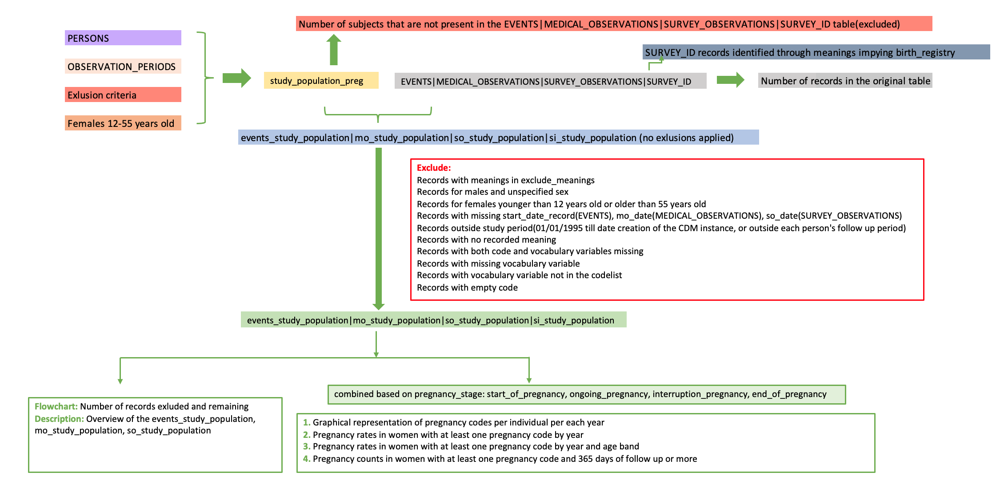
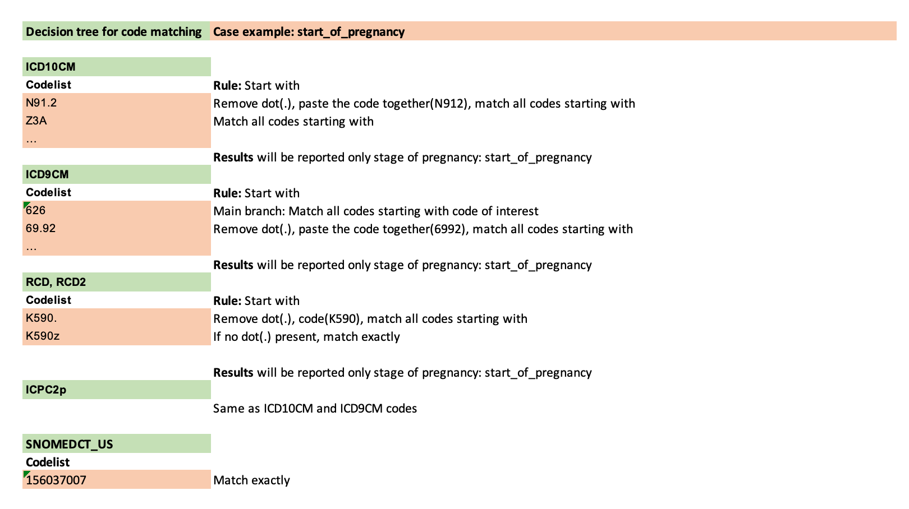
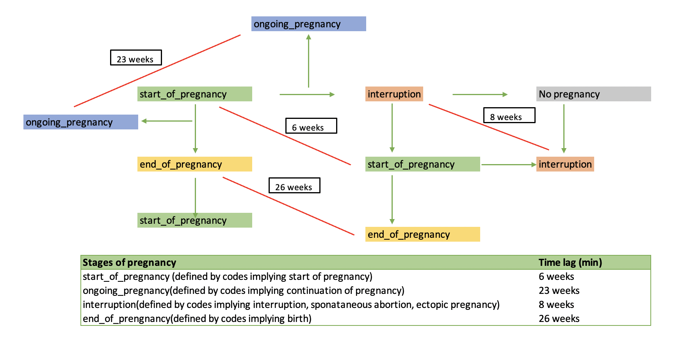
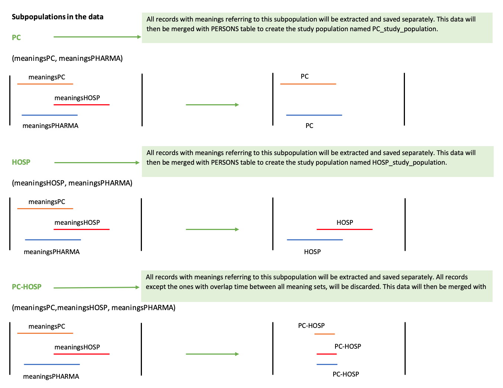

```{css,  echo = F}
/*-- Specify div's for 'boxes', change color of TOC and center align titles: --*/
div.box1 {background-color: #f5f5f0; border-radius: 5px; padding: 30px; margin-right: 0px}
div.box1 {background-color: #f5f5f0; border-radius: 5px; padding: 30px; margin-right: 0px}
div.box2 {background-color: #d4e5d2; border-radius: 5px; padding: 30px; margin-right: 0px}
div.box3 {border-style: solid; border-color: #f5f5f0; border-width: medium; border-radius: 30px; padding: 5px; margin-right: 0px}

.list-group-item.active, .list-group-item.active:focus, .list-group-item.active:hover {background-color: #76b82a; border-color: #76b82a}
h1 {text-align: center; color: #3c7b8a}
h2 {text-align: center; color: #76b82a}

/*-- Add logo (based on https://rstudio4edu.github.io/rstudio4edu-book/rmd-fancy.html): --*/
#TOC::before {content: ""; display: block; height: 60px; margin: 30px 10px 30px; background-image: url("conception_logo.png"); background-size: contain; background-position: center center; background-repeat: no-repeat}
```

```{r set_locale, include=FALSE}
Sys.setlocale("LC_ALL", "C")
`%!in%` = Negate(`%in%`)
```

<div class = 'box1'>

**Level 3:** Pregnancy records counts and rates in the study population 

 - **Script directory:** `r projectFolder`
 - **Date/time:** `r Sys.time()`
 - **DAP:** `r data_access_provider_name`
 - **Data source:** `r data_source_name`

</div>

<div class = 'box2'>
```{r time_log, echo=F}
if (subpopulations_present=="No"){
timelog_preg<-fread(paste0(preg_dir,"Time_log/", list.files(paste0(preg_dir,"Time_log/"),"time_pregnancy.csv")))
kable(timelog_preg)
} else {
timelog_preg<-fread(paste0(preg_dir,subpopulations_names[a], "/Time_log/","time_pregnancy.csv"))
kable(timelog_preg)
}
```
</div>

<div class = 'box1'>

The analysis contains the following steps:


The codelist algorithm is explained below:

<br>



<br>

Records with a time difference smaller than the time lag explained below will be removed from analysis of rates and counts.
  

<br>



<br>

If subpopulations are available in your data the analysis will be performed separately for each subpopulation.
In case there is an overlapping subpopulation only subjects in the overlap period will be taken into account.
***Example:***

<br>



`year` is retrieved from `start_date_record` for the **EVENTS** table, `mo_date` for the **MEDICAL_OBSERVATIONS** table, `so_date` for **SURVEY_OBSERVATIONS** table and `survey_date` for **SURVEY_ID** table.

</div>

<br>

<div class = 'box1'>

Used parameters

```{r, echo=F,include=FALSE}
parameter_file_fl<-list.files(paste0(projectFolder,"/p_parameters/"),"study_parameters")
parameter_file<-as.data.table(read_excel(paste0(projectFolder,"/p_parameters/",parameter_file_fl),col_types = "text", sheet = "study_parameters"))
#Set parameters basic parameters
preg <- parameter_file[variable=="pregnancy_algorithm_presence",value]
min <- parameter_file[variable=="min_age_preg",value]
max <- parameter_file[variable=="max_age_preg",value]
st <- parameter_file[variable=="meanings_start_pregnancy",value]
int <- parameter_file[variable=="meanings_interruption_pregnancy",value]
on <- parameter_file[variable=="meanings_ongoing_pregnancy",value]
en <- parameter_file[variable=="meanings_end_pregnancy",value]
info_start<-data.table(Indicator=c("Pregnancy algorithm presence",
                                   "Minimun age pregnancy start",
                                   "Maximum age pregnancy start",
                                   "SURVEY_ID meanings classified as start_of_pregnancy",
                                   "SURVEY_ID meanings classified as interruption_pregnancy",
                                   "SURVEY_ID meanings classified as ongoing_pregnancy",
                                   "SURVEY_ID meanings classified as end_of_pregnancy"),
                       Value=c(preg,
                               min,
                               max,
                               st,
                               int,
                               on,
                               en))

```

```{r, echo=FALSE}
datatable(info_start)
```

</div>

<div class = 'box3'>

## 1. Pregnancy records count by meaning, age band, year and event definition

<br>

```{r preg_yam, echo=F}
if (subpopulations_present=="No"){
  if(length(list.files(paste0(preg_dir,"Masked/"), pattern="pregnancy_counts_yam_masked.csv"))>0){
preg_yam<-fread(paste0(preg_dir,"Masked/", list.files(paste0(preg_dir,"Masked/"), pattern="pregnancy_counts_yam_masked.csv")))
if(preg_yam[,.N]>0){
 if(preg_yam[,.N]>12000){
           print("If the table contanins more than 12000 records it can not be displayed in the report. For the complete table, go to g_output/PREGNANCY/pregnancy_counts_yam.csv")
datatable(head(preg_yam,12000), options = list(scrollX=T))
 } else {
        datatable(preg_yam, options = list(scrollX=T))
 }
} else {
  preg_yam<-NULL
  print("This table cannot be produced based on the available data.")
}
  } else {
    preg_yam<-NULL
  print("This table cannot be produced based on the available data.")
}
} else {
    if(length(list.files(paste0(preg_dir,subpopulations_names[a], "/Masked/"), pattern="pregnancy_counts_yam_masked.csv"))>0){
  preg_yam<-fread(paste0(preg_dir,subpopulations_names[a], "/Masked/", list.files(paste0(preg_dir,subpopulations_names[a], "/Masked/"), pattern="pregnancy_counts_yam_masked.csv")))
  if (preg_yam[,.N]>0){
      if(preg_yam[,.N]>12000){  
    print("If the table contanins more than 12000 records it can not be displayed in the report. For the complete table, go to g_output/PREGNANCY/pregnancy_counts_yam_masked.csv")
      datatable(head(preg_yam,12000), options = list(scrollX=T))
        } else {
    datatable(preg_yam, options = list(scrollX=T))
      }
  } else {
    preg_yam<-NULL
    print("This table cannot be produced based on the available data.")
}
    } else {
      preg_yam<-NULL
  print("This table cannot be produced based on the available data.")
    }
}
```

<br>

A count smaller than 5(counts between 1 and 4) will be represented in the graphs with a value of 3 for visualization. 

```{r preg_yam_graph, echo=FALSE, warning=FALSE}
if(!is.null(preg_yam)){
preg_yam_graph<-preg_yam[no_records=="<5", no_records:= 3]
preg_yam_graph<-preg_yam_graph[,no_records:=as.numeric(no_records)]
preg_yam_graph<-preg_yam_graph[,event_definition_meaning:=paste(event_definition,meaning,sep=":")]
} else {
  preg_yam_graph<-NULL
}

if (!is.null(preg_yam_graph)){
  fig.preg_yam_graph<-vector(mode="list", length=length(unique(preg_yam_graph[,age_band])))
  for(i in 1:length(unique(preg_yam_graph[,age_band]))){
  fig.preg_yam_graph[[i]]<-ggplotly(ggplot(preg_yam_graph[age_band==unique(preg_yam_graph[,age_band])[i]], aes(fill=event_definition_meaning, y=no_records, x=year)) + 
   geom_line(aes(color=event_definition_meaning),stat = "identity") +
  geom_point(aes(color=event_definition_meaning)) + 
    facet_wrap( ~ age_band) +
    ggtitle(paste0("Pregnancy counts by meaning, year, event definition and age band:",unique(preg_yam_graph[,age_band])[i])) +
    xlab("Year") +
     ylab("Count")+
      theme(panel.background = element_rect(fill = "white"), 
            axis.line = element_line(size = 2, colour = "#76b82a"),
            axis.text.x = element_text(angle = 90, hjust = 1),
            axis.title.x = element_text(colour = "#76b82a"),
            axis.title.y = element_text(colour = "#76b82a"),
            plot.title = element_text(colour = "#76b82a"),
            legend.text = element_text(size = 6)))
      
                                     
  }
}

```

```{r display_preg_yam_graph, echo=FALSE}
if(!is.null(preg_yam_graph)){
htmltools::tagList(list(fig.preg_yam_graph))
} else {
  print("This table cannot be produced based on the available data.") 
}
```

</div>

<br>

<div class = 'box3'>

## 2. Pregnancy records count by meaning, year and event definition

<br>

```{r preg_ym, echo=F}
if (subpopulations_present=="No"){
  if(length(list.files(paste0(preg_dir,"Masked/"), pattern="pregnancy_counts_ym_masked.csv"))>0){
preg_ym<-fread(paste0(preg_dir,"Masked/", list.files(paste0(preg_dir,"Masked/"), pattern="pregnancy_counts_ym_masked.csv")))
if(preg_ym[,.N]>0){
 if(preg_ym[,.N]>12000){
           print("If the table contanins more than 12000 records it can not be displayed in the report. For the complete table, go to g_output/PREGNANCY/pregnancy_counts_ym_masked.csv")
datatable(head(preg_ym,12000), options = list(scrollX=T))
 } else {
        datatable(preg_ym, options = list(scrollX=T))
 }
} else {
  preg_ym<-NULL
  print("This table cannot be produced based on the available data.")
}
  } else {
    preg_ym<-NULL
  print("This table cannot be produced based on the available data.")
}
} else {
    if(length(list.files(paste0(preg_dir,subpopulations_names[a], "/Masked/"), pattern="pregnancy_counts_ym_masked.csv"))>0){
  preg_ym<-fread(paste0(preg_dir,subpopulations_names[a], "/Masked/", list.files(paste0(preg_dir,subpopulations_names[a], "/Masked/"), pattern="pregnancy_counts_ym_masked.csv")))
  if (preg_ym[,.N]>0){
      if(preg_ym[,.N]>12000){  
    print("If the table contanins more than 12000 records it can not be displayed in the report. For the complete table, go to g_output/PREGNANCY/pregnancy_counts_ym_masked.csv")
      datatable(head(preg_ym,12000), options = list(scrollX=T))
        } else {
    datatable(preg_ym, options = list(scrollX=T))
      }
  } else {
    preg_ym<-NULL
    print("This table cannot be produced based on the available data.")
}
    } else {
      preg_ym<-NULL
  print("This table cannot be produced based on the available data.")
    }
}
```

<br>

A count smaller than 5(counts between 1 and 4) will be represented in the graphs with a value of 3 for visualization. 

```{r preg_ym_graph, echo=FALSE, warning=FALSE}
if(!is.null(preg_ym)){
preg_ym_graph<-preg_ym[no_records=="<5", no_records:= 3]
preg_ym_graph<-preg_ym_graph[,no_records:=as.numeric(no_records)]
} else {
  preg_ym_graph<-NULL
}

if (!is.null(preg_ym_graph)){
  ggplotly(ggplot(preg_ym_graph, aes(fill=meaning, y=no_records, x=year)) + 
   geom_line(aes(color=meaning)) +
  geom_point(aes(color=meaning)) + 
    facet_wrap( ~ event_definition) +
    ggtitle("Pregnancy counts by meaning, year and event definition") +
    xlab("Year") +
     ylab("Count")+
      theme(panel.background = element_rect(fill = "white"), 
            axis.line = element_line(size = 2, colour = "#76b82a"),
            axis.text.x = element_text(angle = 90, hjust = 1),
            axis.title.x = element_text(colour = "#76b82a"),
            axis.title.y = element_text(colour = "#76b82a"),
            plot.title = element_text(colour = "#76b82a"),
            legend.text = element_text(size = 6)))
      
                                     
}

```


</div>

<br>

<div class = 'box3'>

## 3. Pregnancy records count by age band, year and event definition

<br>

```{r preg_ya, echo=F}
if (subpopulations_present=="No"){
  if(length(list.files(paste0(preg_dir,"Masked/"), pattern="pregnancy_counts_ya_masked.csv"))>0){
preg_ya<-fread(paste0(preg_dir,"Masked/", list.files(paste0(preg_dir,"Masked/"), pattern="pregnancy_counts_ya_masked.csv")))
if(preg_ya[,.N]>0){
 if(preg_ya[,.N]>12000){
           print("If the table contanins more than 12000 records it can not be displayed in the report. For the complete table, go to g_output/PREGNANCY/pregnancy_counts_ya_masked.csv")
datatable(head(preg_ya,12000), options = list(scrollX=T))
 } else {
        datatable(preg_ya, options = list(scrollX=T))
 }
} else {
  preg_ya<-NULL
  print("This table cannot be produced based on the available data.")
}
  } else {
    preg_ya<-NULL
  print("This table cannot be produced based on the available data.")
}
} else {
    if(length(list.files(paste0(preg_dir,subpopulations_names[a], "/Masked/"), pattern="pregnancy_counts_ya_masked.csv"))>0){
  preg_ya<-fread(paste0(preg_dir,subpopulations_names[a], "/Masked/", list.files(paste0(preg_dir,subpopulations_names[a], "/Masked/"), pattern="pregnancy_counts_ya_masked.csv")))
  if (preg_ya[,.N]>0){
      if(preg_ya[,.N]>12000){  
    print("If the table contanins more than 12000 records it can not be displayed in the report. For the complete table, go to g_output/PREGNANCY/pregnancy_counts_ya_masked.csv")
      datatable(head(preg_ya,12000), options = list(scrollX=T))
        } else {
    datatable(preg_ya, options = list(scrollX=T))
      }
  } else {
    preg_ya<-NULL
    print("This table cannot be produced based on the available data.")
}
    } else {
      preg_ya<-NULL
  print("This table cannot be produced based on the available data.")
    }
}
```

<br>

A count smaller than 5(counts between 1 and 4) will be represented in the graphs with a value of 3 for visualization. 

```{r preg_ya_graph, echo=FALSE, warning=FALSE}
if(!is.null(preg_ya)){
preg_ya_graph<-preg_ya[no_records=="<5", no_records:= 3]
preg_ya_graph<-preg_ya_graph[,no_records:=as.numeric(no_records)]
} else {
  preg_ya_graph<-NULL
}

if (!is.null(preg_ya_graph)){
  ggplotly(ggplot(preg_ya_graph, aes(fill=age_band, y=no_records, x=year)) + 
   geom_line(aes(color=age_band)) +
  geom_point(aes(color=age_band)) + 
    facet_wrap( ~ event_definition) +
    ggtitle("Pregnancy counts by age_band, year and event definition") +
    xlab("Year") +
     ylab("Count")+
      theme(panel.background = element_rect(fill = "white"), 
            axis.line = element_line(size = 2, colour = "#76b82a"),
            axis.text.x = element_text(angle = 90, hjust = 1),
            axis.title.x = element_text(colour = "#76b82a"),
            axis.title.y = element_text(colour = "#76b82a"),
            plot.title = element_text(colour = "#76b82a"),
            legend.text = element_text(size = 6)))
      
                                     
}

```


</div>

<br>

<div class = 'box3'>

## 4. Pregnancy records count by year and event definition

<br>

```{r preg_y, echo=F}
if (subpopulations_present=="No"){
  if(length(list.files(paste0(preg_dir,"Masked/"), pattern="pregnancy_counts_y_masked.csv"))>0){
preg_y<-fread(paste0(preg_dir,"Masked/", list.files(paste0(preg_dir,"Masked/"), pattern="pregnancy_counts_y_masked.csv")))
if(preg_y[,.N]>0){
 if(preg_y[,.N]>12000){
           print("If the table contanins more than 12000 records it can not be displayed in the report. For the complete table, go to g_output/PREGNANCY/pregnancy_counts_y_masked.csv")
datatable(head(preg_y,12000), options = list(scrollX=T))
 } else {
        datatable(preg_y, options = list(scrollX=T))
 }
} else {
  preg_y<-NULL
  print("This table cannot be produced based on the available data.")
}
  } else {
    preg_y<-NULL
  print("This table cannot be produced based on the available data.")
}
} else {
    if(length(list.files(paste0(preg_dir,subpopulations_names[a], "/Masked/"), pattern="pregnancy_counts_y_masked.csv"))>0){
  preg_y<-fread(paste0(preg_dir,subpopulations_names[a], "/Masked/", list.files(paste0(preg_dir,subpopulations_names[a], "/Masked/"), pattern="pregnancy_counts_y_masked.csv")))
  if (preg_y[,.N]>0){
      if(preg_y[,.N]>12000){  
    print("If the table contanins more than 12000 records it can not be displayed in the report. For the complete table, go to g_output/PREGNANCY/pregnancy_counts_y_masked.csv")
      datatable(head(preg_y,12000), options = list(scrollX=T))
        } else {
    datatable(preg_y, options = list(scrollX=T))
      }
  } else {
    preg_y<-NULL
    print("This table cannot be produced based on the available data.")
}
    } else {
      preg_y<-NULL
  print("This table cannot be produced based on the available data.")
    }
}
```

<br>

A count smaller than 5(counts between 1 and 4) will be represented in the graphs with a value of 3 for visualization. 

```{r preg_y_graph, echo=FALSE, warning=FALSE}
if(!is.null(preg_y)){
preg_y_graph<-preg_y[no_records=="<5", no_records:= 3]
preg_y_graph<-preg_y_graph[,no_records:=as.numeric(no_records)]
} else {
  preg_y_graph<-NULL
}

if (!is.null(preg_y_graph)){
  ggplotly(ggplot(preg_y_graph, aes(fill=event_definition, y=no_records, x=year)) + 
   geom_line(aes(color=event_definition)) +
  geom_point(aes(color=event_definition)) + 
    ggtitle("Pregnancy counts by year and event definition") +
    xlab("Year") +
     ylab("Count")+
      theme(panel.background = element_rect(fill = "white"), 
            axis.line = element_line(size = 2, colour = "#76b82a"),
            axis.text.x = element_text(angle = 90, hjust = 1),
            axis.title.x = element_text(colour = "#76b82a"),
            axis.title.y = element_text(colour = "#76b82a"),
            plot.title = element_text(colour = "#76b82a"),
            legend.text = element_text(size = 6)))
      
                                     
}

```


</div>

<br>

<div class = 'box3'>

## 5. Pregnancy records count by meaning, year and event definition in women with at least 365 days of follow up

<br>

```{r preg_ym_365, echo=F}
if (subpopulations_present=="No"){
  if(length(list.files(paste0(preg_dir,"Masked/"), pattern="pregnancy_counts_ym_365_masked.csv"))>0){
preg_ym_365<-fread(paste0(preg_dir,"Masked/", list.files(paste0(preg_dir,"Masked/"), pattern="pregnancy_counts_ym_365_masked.csv")))
if(preg_ym_365[,.N]>0){
 if(preg_ym_365[,.N]>12000){
           print("If the table contanins more than 12000 records it can not be displayed in the report. For the complete table, go to g_output/PREGNANCY/pregnancy_counts_ym_365_masked.csv")
datatable(head(preg_ym_365,12000), options = list(scrollX=T))
 } else {
        datatable(preg_ym_365, options = list(scrollX=T))
 }
} else {
  preg_ym_365<-NULL
  print("This table cannot be produced based on the available data.")
}
  } else {
    preg_ym_365<-NULL
  print("This table cannot be produced based on the available data.")
}
} else {
    if(length(list.files(paste0(preg_dir,subpopulations_names[a], "/Masked/"), pattern="pregnancy_counts_ym_365_masked.csv"))>0){
  preg_ym_365<-fread(paste0(preg_dir,subpopulations_names[a], "/Masked/", list.files(paste0(preg_dir,subpopulations_names[a], "/Masked/"), pattern="pregnancy_counts_ym_365_masked.csv")))
  if (preg_ym_365[,.N]>0){
      if(preg_ym_365[,.N]>12000){  
    print("If the table contanins more than 12000 records it can not be displayed in the report. For the complete table, go to g_output/PREGNANCY/pregnancy_counts_ym_365_masked.csv")
      datatable(head(preg_ym_365,12000), options = list(scrollX=T))
        } else {
    datatable(preg_ym_365, options = list(scrollX=T))
      }
  } else {
    preg_ym_365<-NULL
    print("This table cannot be produced based on the available data.")
}
    } else {
      preg_ym_365<-NULL
  print("This table cannot be produced based on the available data.")
    }
}
```

<br>

A count smaller than 5(counts between 1 and 4) will be represented in the graphs with a value of 3 for visualization. 

```{r preg_ym_365_graph, echo=FALSE, warning=FALSE}
if(!is.null(preg_ym_365)){
preg_ym_365_graph<-preg_ym_365[no_records=="<5", no_records:= 3]
preg_ym_365_graph<-preg_ym_365_graph[,no_records:=as.numeric(no_records)]
} else {
  preg_ym_365_graph<-NULL
}

if (!is.null(preg_ym_365_graph)){
  ggplotly(ggplot(preg_ym_365_graph, aes(fill=meaning, y=no_records, x=year)) + 
   geom_line(aes(color=meaning)) +
  geom_point(aes(color=meaning)) + 
    facet_wrap( ~ event_definition) +
    ggtitle("Pregnancy counts by meaning, year and event definition") +
    xlab("Year") +
     ylab("Count")+
      theme(panel.background = element_rect(fill = "white"), 
            axis.line = element_line(size = 2, colour = "#76b82a"),
            axis.text.x = element_text(angle = 90, hjust = 1),
            axis.title.x = element_text(colour = "#76b82a"),
            axis.title.y = element_text(colour = "#76b82a"),
            plot.title = element_text(colour = "#76b82a"),
            legend.text = element_text(size = 6)))
      
                                     
}

```


</div>

<br>

<div class = 'box3'>

## 6. Calculations

```{r calculations_table, echo=FALSE}
calculations_pregnancy<-data.table(rbind(
   cbind(indicator= "Pregnancy records count by meaning, age band, year and event definition",           
         variable_name=c("no_records","no_women", "total_records"),
         stratifying_variable=c("event_definition, meaning of the record, age and year","event_definition, meaning of the record, age and year","event_definition and meaning of the record"),
         calculation=c("Number of pregnancy records stratified by event definition, meaning, age band and year","Unique number of women stratified by event definition, meaning, age band and year","Number of pregnancy records stratified by event definition and meaning of pregnancy record")),
         cbind(indicator= "Pregnancy records count by meaning, year and event definition",           
         variable_name=c("no_records","no_women", "total_records"),
         stratifying_variable=c("event_definition, meaning of the record and year","event_definition, meaning of the record and year","event_definition and meaning of the record"),
         calculation=c("Number of pregnancy records stratified by event definition, meaning and year","Unique number of women stratified by event definition, meaning and year","Number of pregnancy records stratified by event definition and meaning of pregnancy record")),
            cbind(indicator= "Pregnancy records count by age band, year and event definition",           
         variable_name=c("no_records","no_women", "total_records"),
         stratifying_variable=c("event_definition, age and year","event_definition, age and year","event_definition"),
         calculation=c("Number of pregnancy records stratified by event definition,age and year","Unique number of women stratified by event definition, age and year","Number of pregnancy records stratified by event definition")),
               cbind(indicator= "Pregnancy records count by year and event definition",           
         variable_name=c("no_records","no_women", "total_records"),
         stratifying_variable=c("event_definition and year","event_definition and year","event_definition"),
         calculation=c("Number of pregnancy records stratified by event definition  and year","Unique number of women stratified by event definition and year","Number of pregnancy records stratified by event definition")),
   cbind(indicator= "Pregnancy records count by meaning, year and event definition in women with at least 365 days of follow up",           
         variable_name=c("no_records","no_women", "total_records"),
         stratifying_variable=c("event_definition, meaning of the record and year","event_definition, meaning of the record and year","event_definition and meaning of the record"),
         calculation=c("Number of pregnancy records for women with at least 365 days of follow up stratified by event definition, meaning and year","Unique number of women with at least 365 days of follow up stratified by event definition, meaning and year","Number of pregnancy records for women with at least 365 days of follow up stratified by event definition and meaning of pregnancy record"))))
datatable(calculations_pregnancy)
```

</div>

<br>

<div class = 'box2'>

Author: Vjola Hoxhaj Drs.   
email: v.hoxhaj@umcutrecht.nl   
Organisation: UMC Utrecht, Utrecht, The Netherlands    

</div>
