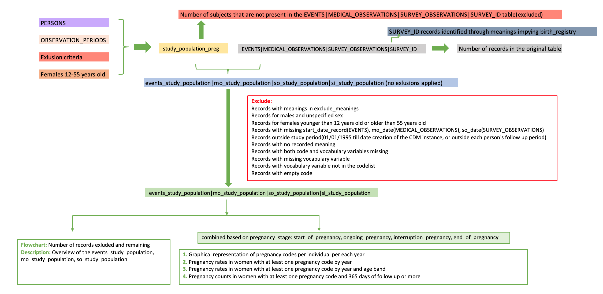
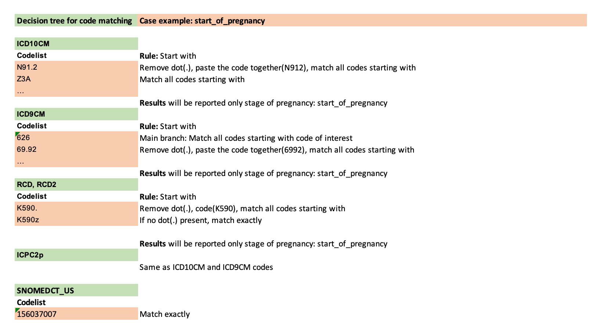

```{css,  echo = F}
/*-- Specify div's for 'boxes', change color of TOC and center align titles: --*/
div.box1 {background-color: #f5f5f0; border-radius: 5px; padding: 30px; margin-right: 0px}
div.box1 {background-color: #f5f5f0; border-radius: 5px; padding: 30px; margin-right: 0px}
div.box2 {background-color: #d4e5d2; border-radius: 5px; padding: 30px; margin-right: 0px}
div.box3 {border-style: solid; border-color: #f5f5f0; border-width: medium; border-radius: 30px; padding: 5px; margin-right: 0px}

.list-group-item.active, .list-group-item.active:focus, .list-group-item.active:hover {background-color: #76b82a; border-color: #76b82a}
h1 {text-align: center; color: #3c7b8a}
h2 {text-align: center; color: #76b82a}

/*-- Add logo (based on https://rstudio4edu.github.io/rstudio4edu-book/rmd-fancy.html): --*/
#TOC::before {content: ""; display: block; height: 60px; margin: 30px 10px 30px; background-image: url("conception_logo.png"); background-size: contain; background-position: center center; background-repeat: no-repeat}
```

```{r set_locale, include=FALSE}
Sys.setlocale("LC_ALL", "C")
`%!in%` = Negate(`%in%`)
```

<div class = 'box1'>

**Level 3:** Pregnancy records counts and rates in the study population 

 - **Script directory:** `r projectFolder`
 - **Date/time:** `r Sys.time()`
 - **DAP:** `r data_access_provider_name`
 - **Data source:** `r data_source_name`

</div>

<div class = 'box2'>
```{r time_log, echo=F}
if (subpopulations_present=="No"){
timelog_preg<-fread(paste0(preg_dir,"Time_log/", list.files(paste0(preg_dir,"Time_log/"),"time_pregnancy.csv")))
kable(timelog_preg)
} else {
timelog_preg<-fread(paste0(preg_dir,subpopulations_names[a], "/Time_log/","time_pregnancy.csv"))
kable(timelog_preg)
}
```
</div>

```{r, echo=FALSE}
#Add labels
if(!"label_records" %in% colnames(records_categories)){records_categories[,label_records:=1:records_categories[,.N]]}
if(!"label_users" %in% colnames(users_categories)){users_categories[,label_users:=1:users_categories[,.N]]}
if(!"label_py" %in% colnames(followup_categories)){followup_categories[,label_py:=1:followup_categories[,.N]]}
```

<div class = 'box1'>

The analysis contains the following steps:


The codelist algorithm is explained below:

<br>



<br>

Records with a time difference smaller than the time lag explained below will be removed from analysis of rates and counts.


<br>

If subpopulations are available in your data the analysis will be performed separately for each subpopulation.
In case there is an overlapping subpopulation only subjects in the overlap period will be taken into account.
***Example:***

<br>


`year` is retrieved from `start_date_record` for the **EVENTS** table, `mo_date` for the **MEDICAL_OBSERVATIONS** table, `so_date` for **SURVEY_OBSERVATIONS** table and `survey_date` for **SURVEY_ID** table.

</div>

<br>

<div class = 'box1'>

Used parameters

```{r, echo=F,include=FALSE}
parameter_file_fl<-list.files(paste0(projectFolder,"/p_parameters/"),"study_parameters")
parameter_file<-as.data.table(read_excel(paste0(projectFolder,"/p_parameters/",parameter_file_fl),col_types = "text", sheet = "study_parameters"))
#Set parameters basic parameters
preg <- parameter_file[variable=="pregnancy_algorithm_presence",value]
min <- parameter_file[variable=="min_age_preg",value]
max <- parameter_file[variable=="max_age_preg",value]
st <- parameter_file[variable=="meanings_start_pregnancy",value]
int <- parameter_file[variable=="meanings_interruption_pregnancy",value]
on <- parameter_file[variable=="meanings_ongoing_pregnancy",value]
en <- parameter_file[variable=="meanings_end_pregnancy",value]
info_start<-data.table(Indicator=c("Pregnancy algorithm presence",
                                   "Minimun age pregnancy start",
                                   "Maximum age pregnancy start",
                                   "SURVEY_ID meanings classified as start_of_pregnancy",
                                   "SURVEY_ID meanings classified as interruption_pregnancy",
                                   "SURVEY_ID meanings classified as ongoing_pregnancy",
                                   "SURVEY_ID meanings classified as end_of_pregnancy"),
                       Value=c(preg,
                               min,
                               max,
                               st,
                               int,
                               on,
                               en))

```

```{r, echo=FALSE}
datatable(info_start)
```

</div>

<div class = 'box3'>


## 1. Flowchart
<br> 

```{r echo=F}
if (subpopulations_present=="No"){
flowchart_pregnancy<-fread(paste0(preg_dir,"GDPR/",list.files(paste0(preg_dir,"GDPR/"), "pregnancy_flowchart_masked.csv")))
datatable(flowchart_pregnancy, options = list(scrollX=T))
} else {
flowchart_pregnancy<-fread(paste0(preg_dir,subpopulations_names[a], "/GDPR/",list.files(paste0(preg_dir,subpopulations_names[a], "/GDPR/"), "pregnancy_flowchart_masked.csv")))
datatable(flowchart_pregnancy, options = list(scrollX=T))
}
```


</div>

<br>

<div class = 'box3'>

## 2. Description of pregnancy_study_population

<br> 

```{r echo=F}
if (subpopulations_present=="No"){
description_pregnancy<-fread(paste0(preg_dir,"GDPR/",list.files(paste0(preg_dir,"GDPR/"), "pregnancy_description_masked.csv")))
datatable(description_pregnancy, options = list(scrollX=T))
} else {
  description_pregnancy<-fread(paste0(preg_dir,subpopulations_names[a], "/GDPR/", list.files(paste0(preg_dir,subpopulations_names[a], "/GDPR/"),"pregnancy_description_masked.csv")))
datatable(description_pregnancy, options = list(scrollX=T))
}
```

</div>

<br>

<div class = 'box3'>

## 3. Graphical representation of number of women and presence of pregnancy codes

<br> 

#### Number of women and presence of pregnancy codes by year

<br>

```{r echo=F}
if (subpopulations_present=="No"){
  if(length(list.files(paste0(preg_dir,"GDPR/"), pattern="pregnancy_records_per_women_masked.csv"))>0){
preg_rec_women<-fread(paste0(preg_dir,"GDPR/", list.files(paste0(preg_dir,"GDPR/"), pattern="pregnancy_records_per_women_masked.csv")))
cols<-names(preg_rec_women)
preg_rec_women[,lapply(.SD, as.character), .SDcols=cols]

rec<-users_categories[,c("range", "label_users")]
rec[,range:=as.character(range)]
setnames(rec, "range", "1_pregnancy_record")
preg_rec_women<-merge.data.table(preg_rec_women, rec, by="1_pregnancy_record", all.x=T, allow.cartesian = T)
setnames(preg_rec_women,"label_users", "label_1")

rec<-users_categories[,c("range", "label_users")]
rec[,range:=as.character(range)]
setnames(rec, "range", "2_pregnancy_records")
preg_rec_women<-merge.data.table(preg_rec_women, rec, by="2_pregnancy_records", all.x=T, allow.cartesian = T)
setnames(preg_rec_women,"label_users", "label_2")

rec<-users_categories[,c("range", "label_users")]
rec[,range:=as.character(range)]
setnames(rec, "range", "3_pregnancy_records")
preg_rec_women[,`3_pregnancy_records`:=as.character(`3_pregnancy_records`)]
preg_rec_women<-merge.data.table(preg_rec_women, rec, by="3_pregnancy_records", all.x=T, allow.cartesian = T)
setnames(preg_rec_women,"label_users", "label_3")

rec<-users_categories[,c("range", "label_users")]
rec[,range:=as.character(range)]
preg_rec_women[,`more_than_4_pregnancy_records`:=as.character(`more_than_4_pregnancy_records`)]
setnames(rec, "range", "more_than_4_pregnancy_records")
preg_rec_women<-merge.data.table(preg_rec_women, rec, by="more_than_4_pregnancy_records", all.x=T, allow.cartesian = T)
setnames(preg_rec_women,"label_users", "label_4")

setcolorder(preg_rec_women,c("event_definition","year","1_pregnancy_record","2_pregnancy_records","3_pregnancy_records","more_than_4_pregnancy_records"))

if(preg_rec_women[,.N]>0){
datatable(preg_rec_women,  options = list(scrollX=T), filter = "top")
  } else {
    preg_rec_women<-NULL
  print("This table cannot be produced based on the available data.")
  }
} else {
  preg_rec_women<-NULL
  print("This table cannot be produced based on the available data.")
}
} else {
    if(length(list.files(paste0(preg_dir,subpopulations_names[a], "/GDPR/"), pattern="pregnancy_records_per_women_masked.csv"))>0){
    preg_rec_women<-fread(paste0(preg_dir,subpopulations_names[a], "/GDPR/", list.files(paste0(preg_dir,subpopulations_names[a], "/GDPR/"), pattern="pregnancy_records_per_women_masked.csv")))
    cols<-names(preg_rec_women)
preg_rec_women[,lapply(.SD, as.character), .SDcols=cols]

rec<-users_categories[,c("range", "label_users")]
rec[,range:=as.character(range)]
setnames(rec, "range", "1_pregnancy_record")
preg_rec_women<-merge.data.table(preg_rec_women, rec, by="1_pregnancy_record", all.x=T, allow.cartesian = T)
setnames(preg_rec_women,"label_users", "label_1")

rec<-users_categories[,c("range", "label_users")]
rec[,range:=as.character(range)]
setnames(rec, "range", "2_pregnancy_records")
preg_rec_women<-merge.data.table(preg_rec_women, rec, by="2_pregnancy_records", all.x=T, allow.cartesian = T)
setnames(preg_rec_women,"label_users", "label_2")

rec<-users_categories[,c("range", "label_users")]
rec[,range:=as.character(range)]
setnames(rec, "range", "3_pregnancy_records")
preg_rec_women[,`3_pregnancy_records`:=as.character(`3_pregnancy_records`)]
preg_rec_women<-merge.data.table(preg_rec_women, rec, by="3_pregnancy_records", all.x=T, allow.cartesian = T)
setnames(preg_rec_women,"label_users", "label_3")

rec<-users_categories[,c("range", "label_users")]
rec[,range:=as.character(range)]
preg_rec_women[,`more_than_4_pregnancy_records`:=as.character(`more_than_4_pregnancy_records`)]
setnames(rec, "range", "more_than_4_pregnancy_records")
preg_rec_women<-merge.data.table(preg_rec_women, rec, by="more_than_4_pregnancy_records", all.x=T, allow.cartesian = T)
setnames(preg_rec_women,"label_users", "label_4")

setcolorder(preg_rec_women,c("event_definition","year","1_pregnancy_record","2_pregnancy_records","3_pregnancy_records","more_than_4_pregnancy_records"))
    if(preg_rec_women[,.N]>0){
datatable(preg_rec_women,  options = list(scrollX=T), filter = "top")
    } else {
      preg_rec_women<-NULL
    print("This table cannot be produced based on the available data.") 
    }
  } else {
    preg_rec_women<-NULL
    print("This table cannot be produced based on the available data.")
  }
}
```


Counts of 0 are displayed as empty cells in the graph. 

```{r preg_rec_women_graph, echo=F}
if(!is.null(preg_rec_women)){
  #Add labels
preg_rec_women_graph<-preg_rec_women[,c("event_definition", "year", "label_1", "label_2", "label_3", "label_4")]
names(preg_rec_women_graph)<-c("event_definition","year", "1_pregnancy_record", "2_pregnancy_records","3_pregnancy_records", "more_than_4_pregancy_records")

graph_preg<-suppressWarnings(data.table(melt(preg_rec_women_graph,id.vars = c("year","event_definition"),
                measure.vars = c("1_pregnancy_record", "2_pregnancy_records", "3_pregnancy_records","more_than_4_pregancy_records"))))
setnames(graph_preg,"value","count")
setnames(graph_preg,"variable","presence_of_codes_category")
graph_preg[,year:=as.character(year)]


ggplotly(ggplot(graph_preg, aes(fill=presence_of_codes_category, y=year, x=count)) + 
    geom_bar(position="stack", stat="identity") +
      scale_fill_brewer(palette = "Greens") + 
      theme(panel.background = element_rect(fill = "white"), axis.line = element_line(size = 2, colour = "#76b82a")) +
      facet_wrap( ~ event_definition))
} else {
    print("This table cannot be produced based on the available data.")
  }

```

---
<br>

#### Number of women and presence of pregnancy codes combination

Event definition meanings:   
**S_I_O_E:** having pregnancy codes/meanings indicating start, interruption, ongoing and end of pregnancy during the study period     
**S_I_O:** having pregnancy codes/meanings indicating start, interruption, ongoing but no end of pregnancy code during the study period     
**S_I_E:** having pregnancy codes/meanings indicating start, interruption, end but no ongoing pregnancy code during the study period     
**S_O_E:** having pregnancy codes/meanings indicating start, ongoing, end but no interruption pregnancy code during the study period      
**I_O_E:** having pregnancy codes/meanings indicating interruption, ongoing, end but no start of pregnancy code during the study period      
**S_I:** having pregnancy codes/meanings indicating start, interruption, but no ongoing and end of pregnancy code during the study period       
**S_O:** having pregnancy codes/meanings indicating start, ongoing, but no interruption and end of pregnancy code during the study period       
**S_E:** having pregnancy codes/meanings indicating start, end, but no ongoing and interruption pregnancy code during the study period     
**I_O:** having pregnancy codes/meanings indicating interruption, ongoing but no start and end of pregnancy code during the study period      
**I_E:** having pregnancy codes/meanings indicating interruption, end but no start and ongoing pregnancy code during the study period      
**O_E:** having pregnancy codes/meanings indicating ongoing, end but no start and interruption pregnancy code during the study period      
**S:** having pregnancy codes/meanings indicating only start of pregnancy during the study period      
**I:** having pregnancy codes/meanings indicating only interruption pregnancy during the study period       
**O:** having pregnancy codes/meanings indicating only ongoing pregnancy during the study period     
**E:** having pregnancy codes/meanings indicating only end of pregnancy during the study period     
**no_pregnancy_record:** women in the study population with no pregnancy record during the study period
<br>

```{r echo=F}
if (subpopulations_present=="No"){
  if(length(list.files(paste0(preg_dir,"GDPR/"), pattern="pregnancy_combined_records_masked.csv"))>0){
preg_rec_comb<-fread(paste0(preg_dir,"GDPR/", list.files(paste0(preg_dir,"GDPR/"), pattern="pregnancy_combined_records_masked.csv")))
if(preg_rec_comb[,.N]>0){
datatable(preg_rec_comb, options = list(scrollX=T))
  } else {
    preg_rec_comb<-NULL
  print("This table cannot be produced based on the available data.")
  }
} else {
  preg_rec_comb<-NULL
  print("This table cannot be produced based on the available data.")
}
} else {
    if(length(list.files(paste0(preg_dir,subpopulations_names[a], "/GDPR/"), pattern="pregnancy_combined_records_masked.csv"))>0){
    preg_rec_comb<-fread(paste0(preg_dir,subpopulations_names[a], "/GDPR/", list.files(paste0(preg_dir,subpopulations_names[a], "/GDPR/"), pattern="pregnancy_combined_records_masked.csv")))
    if(preg_rec_comb[,.N]>0){
datatable(preg_rec_comb, options = list(scrollX=T))
    } else {
      preg_rec_comb<-NULL
    print("This table cannot be produced based on the available data.") 
    }
  } else {
    preg_rec_comb<-NULL
    print("This table cannot be produced based on the available data.")
  }
}
```


```{r preg_rec_comb, echo=F}
if(!is.null(preg_rec_comb)){
# Compute the cumulative percentages (top of each rectangle)
ggplot(preg_rec_comb, aes(y=percentage_no_women, x=event_definition)) + 
      geom_bar(stat="identity", color="darkgreen", fill="#76b82a")+
  geom_text(aes(label=percentage_no_women),size=3, vjust=1.6) +
    ggtitle("Combination of pregnancy records in the study population") +
  ylab("Percentage") +
  theme(axis.text.y = element_blank(),
        axis.ticks.y = element_blank(),
        axis.text.x=element_text(angle = 90),
        plot.title = element_text(color="#76b82a", face="bold"))
}else{ print("This table cannot be produced based on the available data.")}

```

</div>

<br>

<div class = 'box3'>

## 4. Calculations

```{r calculations_table, echo=FALSE}
calculations_pregnancy<-data.table(rbind(
   cbind(indicator= "Number of women and presence of pregnancy codes by year",
          variable_name=c("1_pregnancy_record", 
                          "2_pregnancy_records", 
                          "3_pregnancy_record", 
                          "more_than_4_pregnancy_records"),
         stratifying_variable="event_definition and year",
         calculation=c("Number of women having one pregnancy record stratified by the event definition and year",
                       "Number of women having two pregnancy record stratified by the event definition and year",
                       "Number of women having three pregnancy record stratified by the event definition and year",
                       "Number of women having four or more pregnancy record stratified by the event definition and year")),
  
   cbind(indicator= "Number of women and presence of pregnancy codes combination",           
         variable_name=c("no_women", 
                         "total_women",
                         "percentage_no_women"),
         stratifying_variable="event_definition",
         calculation=c("Number of women having a particular or combination of pregnancy record",
                       "Total number of women in the study population",
                       "Calculated as no_women divided by total_women, multiplied by 100 and round to 1 digit")),
      cbind(indicator= "Pregnancy records count by meaning, age band, year and event definition",           
         variable_name=c("no_records","no_women", "total_records"),
         stratifying_variable=c("event_definition, meaning of the record, age and year","event_definition, meaning of the record, age and year","event_definition and meaning of the record"),
         calculation=c("Number of pregnancy records stratified by event definition, meaning, age band and year","Unique number of women stratified by event definition, meaning, age band and year","Number of pregnancy records stratified by event definition and meaning of pregnancy record")),
         cbind(indicator= "Pregnancy records count by meaning, year and event definition",           
         variable_name=c("no_records","no_women", "total_records"),
         stratifying_variable=c("event_definition, meaning of the record and year","event_definition, meaning of the record and year","event_definition and meaning of the record"),
         calculation=c("Number of pregnancy records stratified by event definition, meaning and year","Unique number of women stratified by event definition, meaning and year","Number of pregnancy records stratified by event definition and meaning of pregnancy record")),
            cbind(indicator= "Pregnancy records count by age band, year and event definition",           
         variable_name=c("no_records","no_women", "total_records"),
         stratifying_variable=c("event_definition, age and year","event_definition, age and year","event_definition"),
         calculation=c("Number of pregnancy records stratified by event definition,age and year","Unique number of women stratified by event definition, age and year","Number of pregnancy records stratified by event definition")),
               cbind(indicator= "Pregnancy records count by year and event definition",           
         variable_name=c("no_records","no_women", "total_records"),
         stratifying_variable=c("event_definition and year","event_definition and year","event_definition"),
         calculation=c("Number of pregnancy records stratified by event definition  and year","Unique number of women stratified by event definition and year","Number of pregnancy records stratified by event definition")),
   cbind(indicator= "Pregnancy records count by meaning, year and event definition in women with at least 365 days of follow up",           
         variable_name=c("no_records",
                         "no_women", 
                         "total_records"),
         stratifying_variable=c("event_definition, meaning of the record and year",
                                "event_definition, meaning of the record and year",
                                "event_definition and meaning of the record"),
         calculation=c("Number of pregnancy records for women with at least 365 days of follow up stratified by event definition, meaning and year",
                       "Unique number of women with at least 365 days of follow up stratified by event definition, meaning and year",
                       "Number of pregnancy records for women with at least 365 days of follow up stratified by event definition and meaning of pregnancy record")),
    cbind(indicator= "Rate of pregnancy records by age band and year",           
        variable_name=c("no_records","no_women", "person_years","rate_per_100_py"),
         stratifying_variable=c("event_definition, age band and year",
                                "event_definition, age band and year",
                                "age band and year",
                                "event_definition, age band and year"),
         calculation=c("Number of pregnancy records in the study population by event definition, age and year",
                       "Number of women having a pregnancy record in the study population by event definition, age and year", 
                       "Follow up time by age and year", 
                       "Calculated by dividing no_records with person time, multiply by 100 and round to 2 digits")),
      cbind(indicator= "Rate of pregnancy records by year",           
        variable_name=c("no_records","no_women", "person_years","rate_per_100_py"),
         stratifying_variable=c("event_definition and year",
                                "event_definition and year",
                                "year","event_definition and year"),
         calculation=c("Number of pregnancy records in the study population by event definition and year","Number of women having a pregnancy record in the study population by event definition and year", "Follow up time by year", "Calculated by dividing no_records with person time, multiply by 100 and round to 2 digits"))))
datatable(calculations_pregnancy)
```

</div>

<br>

<div class = 'box2'>

Author: Vjola Hoxhaj Drs.   
email: v.hoxhaj@umcutrecht.nl   
Organisation: UMC Utrecht, Utrecht, The Netherlands    

</div>
