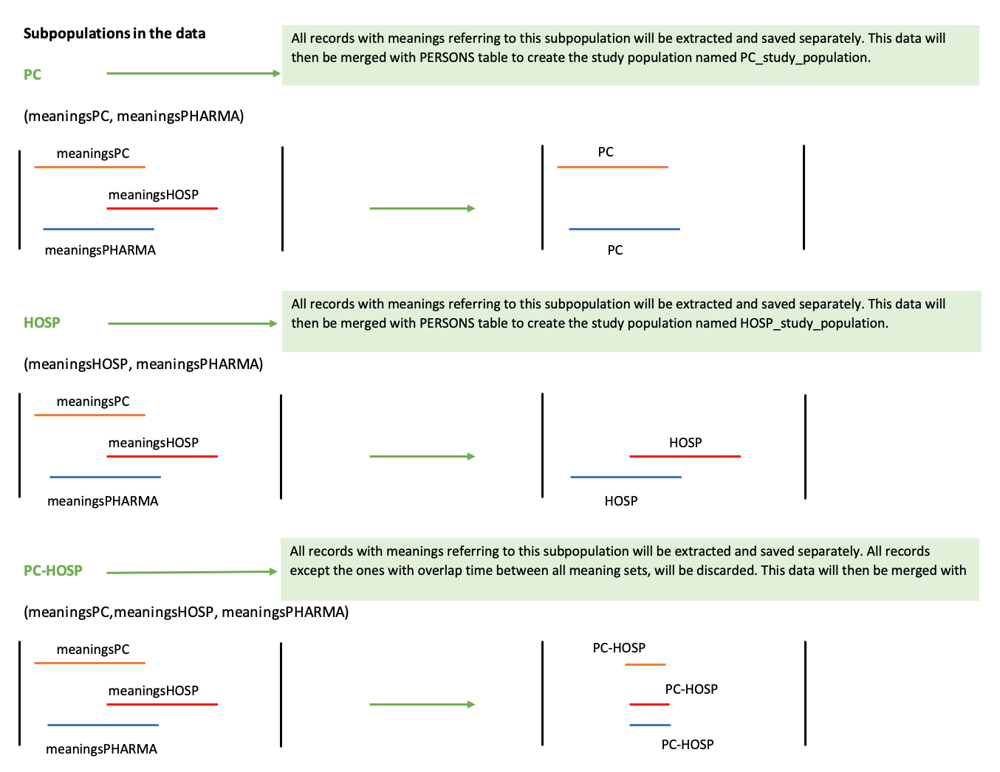

```{css,  echo = F}
/*-- Specify div's for 'boxes', change color of TOC and center align titles: --*/
div.box1 {background-color: #f5f5f0; border-radius: 5px; padding: 30px; margin-right: 0px}
div.box1 {background-color: #f5f5f0; border-radius: 5px; padding: 30px; margin-right: 0px}
div.box2 {background-color: #d4e5d2; border-radius: 5px; padding: 30px; margin-right: 0px}
div.box3 {border-style: solid; border-color: #f5f5f0; border-width: medium; border-radius: 30px; padding: 5px; margin-right: 0px}

.list-group-item.active, .list-group-item.active:focus, .list-group-item.active:hover {background-color: #76b82a; border-color: #76b82a}
h1 {text-align: center; color: #3c7b8a}
h2 {text-align: center; color: #76b82a}

/*-- Add logo (based on https://rstudio4edu.github.io/rstudio4edu-book/rmd-fancy.html): --*/
#TOC::before {content: ""; display: block; height: 60px; margin: 30px 10px 30px; background-image: url("conception_logo.png"); background-size: contain; background-position: center center; background-repeat: no-repeat}
```

```{r set_locale, include=FALSE}
Sys.setlocale("LC_ALL", "C")
`%!in%` = Negate(`%in%`)
```

<div class = 'box1'>

**Level 3:** Pregnancy records counts and rates in the study population 

 - **Script directory:** `r projectFolder`
 - **Date/time:** `r Sys.time()`
 - **DAP:** `r data_access_provider_name`
 - **Data source:** `r data_source_name`
</div>

<div class = 'box2'>
```{r time_log, echo=F}
if (subpopulations_present=="No"){
timelog_preg<-fread(paste0(preg_dir,"Time_log/", list.files(paste0(preg_dir,"Time_log/"),"time_pregnancy.csv")))
kable(timelog_preg)
} else {
timelog_preg<-fread(paste0(preg_dir,subpopulations_names[a], "/Time_log/","time_pregnancy.csv"))
kable(timelog_preg)
}
```
</div>

<div class = 'box1'>

The analysis contains the following steps:


The codelist algorithm is explained below:

<br>


<br>

Records with a time difference smaller than the time lag explained below will be removed from analysis of rates and counts.

<br>


<br>

If subpopulations are available in your data the analysis will be performed separately for each subpopulation.
In case there is an overlapping subpopulation only subjects in the overlap period will be taken into account.
***Example:***

<br>



`year` is retrieved from `start_date_record` for the **EVENTS** table, `mo_date` for the **MEDICAL_OBSERVATIONS** table, `so_date` for **SURVEY_OBSERVATIONS** table and `survey_date` for **SURVEY_ID** table.

</div>

<br>

<div class = 'box1'>

Used parameters

```{r, echo=F,include=FALSE}
parameter_file_fl<-list.files(paste0(projectFolder,"/p_parameters/"),"study_parameters")
parameter_file<-as.data.table(read_excel(paste0(projectFolder,"/p_parameters/",parameter_file_fl),col_types = "text", sheet = "study_parameters"))
#Set parameters basic parameters
preg <- parameter_file[variable=="pregnancy_algorithm_presence",value]
min <- parameter_file[variable=="min_age_preg",value]
max <- parameter_file[variable=="max_age_preg",value]
st <- parameter_file[variable=="meanings_start_pregnancy",value]
int <- parameter_file[variable=="meanings_interruption_pregnancy",value]
on <- parameter_file[variable=="meanings_ongoing_pregnancy",value]
en <- parameter_file[variable=="meanings_end_pregnancy",value]
info_start<-data.table(Indicator=c("Pregnancy algorithm presence",
                                   "Minimun age pregnancy start",
                                   "Maximum age pregnancy start",
                                   "SURVEY_ID meanings classified as start_of_pregnancy",
                                   "SURVEY_ID meanings classified as interruption_pregnancy",
                                   "SURVEY_ID meanings classified as ongoing_pregnancy",
                                   "SURVEY_ID meanings classified as end_of_pregnancy"),
                       Value=c(preg,
                               min,
                               max,
                               st,
                               int,
                               on,
                               en))

```

```{r, echo=FALSE}
datatable(info_start)
```

</div>


<div class = 'box3'>

**Data cleanup**

<mark style="background-color: #d4e5d2">All pregnancy records with the same date of event are removed. All duplicated records and records within the time lag(for recurrent events) are discarded. The removed number of rows is displayed below.</mark>

```{r removed_subjects, echo=F}

if (subpopulations_present=="No"){
  if(length(list.files(preg_dir, pattern="pregnancy_remove_duplicated_records.csv"))>0){
    removed_duplicates<-fread(paste0(preg_dir,list.files(preg_dir, pattern="pregnancy_remove_duplicated_records.csv")))
    
    datatable(removed_duplicates, options = list(scrollX=T))
  }
} else {
 if(length(list.files(paste0(preg_dir,subpopulations_names[a], "/"), pattern="pregnancy_remove_duplicated_records.csv"))>0){
 removed_duplicates<-fread(paste0(preg_dir,subpopulations_names[a],"/",list.files(paste0(preg_dir,subpopulations_names[a], "/"), pattern="pregnancy_remove_duplicated_records.csv")))
 
  datatable(removed_duplicates, options = list(scrollX=T))
   }}
```


<mark style="background-color: #d4e5d2">All records that are removed due to exclusion criteria mentioned in the flowchart are displayed below.</mark>

```{r excluded_subjects, echo=F}

if (subpopulations_present=="No"){
  if(length(list.files(preg_dir, pattern="excluded_people_pregnancy.csv"))>0){
    removed_exclusion<-fread(paste0(preg_dir,list.files(preg_dir, pattern="excluded_people_pregnancy.csv")))
    
    datatable(removed_exclusion, options = list(scrollX=T))
  }
} else {
 if(length(list.files(paste0(preg_dir,subpopulations_names[a], "/"), pattern="excluded_people_pregnancy.csv"))>0){
 removed_exclusion<-fread(paste0(preg_dir,subpopulations_names[a],"/", list.files(paste0(preg_dir,subpopulations_names[a], "/"), pattern="excluded_people_pregnancy.csv")))
 
  datatable(removed_exclusion, options = list(scrollX=T))
   }}
```

</div>

<br>

<div class = 'box3'>

## 1. Rates of pregnancy records by year and age band

<mark style="background-color: #d4e5d2"> Person years are calculated as the observed period for each subject of the study population stratified by sex, age and year of observation.</mark>     
Follow up time is calculated by adding the following observation periods: 
  *people present in the study population but not in the pregnancy_study_population(contribute fully, end_follow_up-start_follow_up)        
  *people having a pregnancy record(contribute fully, end_follow_up-start_follow_up)   
  

Incidence rates of zero will not be shown in the table but will be shown in the graphs.  

```{r preg_ya_rates, echo=F, warning=FALSE}
if (subpopulations_present=="No"){
  if(length(list.files(paste0(preg_dir,"Masked/"), pattern="pregnancy_rates_ya_masked.csv"))>0){
preg_ya_rates<-fread(paste0(preg_dir,"Masked/", list.files(paste0(preg_dir,"Masked/"), pattern="pregnancy_rates_ya_masked.csv")))
if (preg_ya_rates[,.N]>0){
  if (preg_ya_rates[,.N]>12000){
        print("If the table contanins more than 12000 records it can not be displayed in the report. For the complete table, go to g_output/PREGNANCY/pregnancy_rates_ya_masked.csv")
    datatable(head(preg_ya_rates[no_records!=0],12000), options = list(scrollX=T))
  } else {
datatable(preg_ya_rates[no_records!=0], options = list(scrollX=T))
  }
} else {
  preg_ya_rates<-NULL
    print("This table cannot be produced based on the available data or this analysis was not performed.")
}
  } else {
      preg_ya_rates<-NULL
    print("This table cannot be produced based on the available data or this analysis was not performed.")
}
} else {
    if(length(list.files(paste0(preg_dir,subpopulations_names[a], "/Masked/"), pattern="pregnancy_rates_ya_masked.csv"))>0){
  preg_ya_rates<-fread(paste0(preg_dir,subpopulations_names[a], "/Masked/", list.files(paste0(preg_dir,subpopulations_names[a], "/Masked/"), pattern="pregnancy_rates_ya_masked.csv")))
  if (preg_ya_rates[,.N]>0){
   if (preg_ya_rates[,.N]>12000){   
            print("If the table contanins more than 12000 records it can not be displayed in the report. For the complete table, go to g_output/PREGNANCY/pregnancy_rates_ya_masked.csv")
        datatable(head(preg_ya_rates[no_records!=0],12000), options = list(scrollX=T))
   } else {
datatable(preg_ya_rates[no_records!=0], options = list(scrollX=T))
   }
  } else {
      preg_ya_rates<-NULL
      print("This table cannot be produced based on the available data or this analysis was not performed.")
  }
    } else {
        preg_ya_rates<-NULL
    print("This table cannot be produced based on the available data or this analysis was not performed.")
    }
}
```

<br>

Counts smaller than 5 will be replaced with a count of 3. Then the approximate incidence rates will be calculated as the variable of interest divided by the person years and multiplied by 100. The incidence is shown for all age bands.         

```{r preg_ya_rates_graph, echo=FALSE, warning=FALSE}
if(!is.null(preg_ya_rates)){
preg_ya_rates_graph<-preg_ya_rates[event_definition != "N/A"]
preg_ya_rates_graph<-preg_ya_rates_graph[no_records=="<5", no_records:= 3]
preg_ya_rates_graph<-preg_ya_rates_graph[,no_records:=as.numeric(no_records)]
preg_ya_rates_graph<-preg_ya_rates_graph[person_years=="<5", person_years:= 3]
preg_ya_rates_graph<-preg_ya_rates_graph[,person_years:=as.numeric(person_years)]
preg_ya_rates_graph<-preg_ya_rates_graph[rate_per_100_py=="N/A", rate_per_100_py:= round((no_records/person_years)*100,2)]
} else {
 preg_ya_rates_graph<-NULL 
}

if(!is.null(preg_ya_rates_graph)){
  fig.rec_yas<-vector(mode="list", length=length(unique(preg_ya_rates_graph[,age_band])))
for(i in 1:length(unique(preg_ya_rates_graph[,age_band]))){
preg_ya_rates_graph[age_band==unique(preg_ya_rates_graph[,age_band])[i]][,event_definition:=gsub(" ","- \n", event_definition)] 
fig.rec_yas[[i]]<-ggplotly(ggplot(preg_ya_rates_graph[age_band==unique(preg_ya_rates_graph[,age_band])[i]], aes(x = year, y = rate_per_100_py, group=event_definition)) +
                           geom_line(aes(color=event_definition)) +
                           geom_point(aes(color=event_definition)) + 
                               ggtitle(paste0("Rate of pregnancy records by age and year in the study population:", unique(preg_ya_rates_graph[,age_band])[i])) + 
                               xlab("Year") +
                               ylab("Rate per 100 person-years")+
                             theme_classic() +
                             guides(shape = guide_legend(override.aes = list(size = 0.3))) +
                               theme(text=element_text(size=10),
                                 axis.text.x = element_text(angle = 90, hjust = 1),
                                     axis.title.x = element_text(colour = "#76b82a"),
                                     axis.title.y = element_text(colour = "#76b82a"),
                                     plot.title = element_text(colour = "#76b82a"),
                                     strip.text.y = element_text(angle = 0),
                                     legend.title = element_text(size = 6),
               legend.text = element_text(size = 6))) 
                                     
} 
  }
```

```{r display_rec_yas, echo=FALSE}
if(!is.null(preg_ya_rates)){
htmltools::tagList(list(fig.rec_yas))
} else {
  print("This table cannot be produced based on the available data.") 
}
```

</div>

<br>

<div class = 'box3'>

## 2. Rates of pregnancy records by year

Incidence rates of zero will not be shown in the table but will be shown in the graphs.  

```{r preg_y_rates, echo=F, warning=FALSE}
if (subpopulations_present=="No"){
  if(length(list.files(paste0(preg_dir,"Masked/"), pattern="pregnancy_rates_y_masked.csv"))>0){
preg_y_rates<-fread(paste0(preg_dir,"Masked/", list.files(paste0(preg_dir,"Masked/"), pattern="pregnancy_rates_y_masked.csv")))
if (preg_y_rates[,.N]>0){
  if (preg_y_rates[,.N]>12000){
        print("If the table contanins more than 12000 records it can not be displayed in the report. For the complete table, go to g_output/PREGNANCY/pregnancy_rates_y_masked.csv")
    datatable(head(preg_y_rates[no_records!=0],12000), options = list(scrollX=T))
  } else {
datatable(preg_y_rates[no_records!=0], options = list(scrollX=T))
  }
} else {
  preg_y_rates<-NULL
    print("This table cannot be produced based on the available data or this analysis was not performed.")
}
  } else {
      preg_y_rates<-NULL
    print("This table cannot be produced based on the available data or this analysis was not performed.")
}
} else {
    if(length(list.files(paste0(preg_dir,subpopulations_names[a], "/Masked/"), pattern="pregnancy_rates_y_masked.csv"))>0){
  preg_y_rates<-fread(paste0(preg_dir,subpopulations_names[a], "/Masked/", list.files(paste0(preg_dir,subpopulations_names[a], "/Masked/"), pattern="pregnancy_rates_y_masked.csv")))
  if (preg_y_rates[,.N]>0){
   if (preg_y_rates[,.N]>12000){   
            print("If the table contanins more than 12000 records it can not be displayed in the report. For the complete table, go to g_output/PREGNANCY/pregnancy_rates_y_masked.csv")
        datatable(head(preg_y_rates[no_records!=0],12000), options = list(scrollX=T))
   } else {
datatable(preg_y_rates[no_records!=0], options = list(scrollX=T))
   }
  } else {
      preg_y_rates<-NULL
      print("This table cannot be produced based on the available data or this analysis was not performed.")
  }
    } else {
        preg_y_rates<-NULL
    print("This table cannot be produced based on the available data or this analysis was not performed.")
    }
}
```

<br>

Counts smaller than 5 will be replaced with a count of 3. Then the approximate incidence rates will be calculated as the variable of interest divided by the person years and multiplied by 100. The incidence is shown for all age bands.         

```{r preg_y_rates_graph, echo=FALSE, warning=FALSE}
if(!is.null(preg_y_rates)){
preg_y_rates_graph<-preg_y_rates[event_definition != "N/A"]
preg_y_rates_graph<-preg_y_rates_graph[no_records=="<5", no_records:= 3]
preg_y_rates_graph<-preg_y_rates_graph[,no_records:=as.numeric(no_records)]
preg_y_rates_graph<-preg_y_rates_graph[person_years=="<5", person_years:= 3]
preg_y_rates_graph<-preg_y_rates_graph[,person_years:=as.numeric(person_years)]
preg_y_rates_graph<-preg_y_rates_graph[rate_per_100_py=="N/A", rate_per_100_py:= round((no_records/person_years)*100,2)]
} else {
 preg_y_rates_graph<-NULL 
}

if(!is.null(preg_y_rates_graph)){
ggplotly(ggplot(preg_y_rates_graph, aes(x = year, y = rate_per_100_py, group=event_definition)) +
                           geom_line(aes(color=event_definition)) +
                           geom_point(aes(color=event_definition)) + 
                               ggtitle("Rate of pregnancy records by year in the study population") + 
                               xlab("Year") +
                               ylab("Rate per 100 person-years")+
                             theme_classic() +
                             guides(shape = guide_legend(override.aes = list(size = 0.3))) +
                               theme(text=element_text(size=10),
                                 axis.text.x = element_text(angle = 90, hjust = 1),
                                     axis.title.x = element_text(colour = "#76b82a"),
                                     axis.title.y = element_text(colour = "#76b82a"),
                                     plot.title = element_text(colour = "#76b82a"),
                                     strip.text.y = element_text(angle = 0),
                                     legend.title = element_text(size = 6),
               legend.text = element_text(size = 6))) 
                                     
} 
```


</div>

<br>

<div class = 'box3'>

## 3. Calculations

```{r calculations_table, echo=FALSE}
calculations_pregnancy<-data.table(rbind(
    cbind(indicator= "Rate of pregnancy records by age band and year",           
        variable_name=c("no_records","no_women", "person_years","rate_per_100_py"),
         stratifying_variable=c("event_definition, age band and year",
                                "event_definition, age band and year",
                                "age band and year","event_definition, age band and year"),
         calculation=c("Number of pregnancy records in the study population by event definition, age and year","Number of women having a pregnancy record in the study population by event definition, age and year", "Follow up time by age and year", "Calculated by dividing no_records with person time, multiply by 100 and round to 2 digits")),
      cbind(indicator= "Rate of pregnancy records by year",           
        variable_name=c("no_records","no_women", "person_years","rate_per_100_py"),
         stratifying_variable=c("event_definition and year",
                                "event_definition and year",
                                "year","event_definitionand year"),
         calculation=c("Number of pregnancy records in the study population by event definition and year","Number of women having a pregnancy record in the study population by event definition and year", "Follow up time by year", "Calculated by dividing no_records with person time, multiply by 100 and round to 2 digits"))))
datatable(calculations_pregnancy)
```

</div>

<br>

<div class = 'box2'>

Author: Vjola Hoxhaj Drs.   
email: v.hoxhaj@umcutrecht.nl   
Organisation: UMC Utrecht, Utrecht, The Netherlands    

</div>
