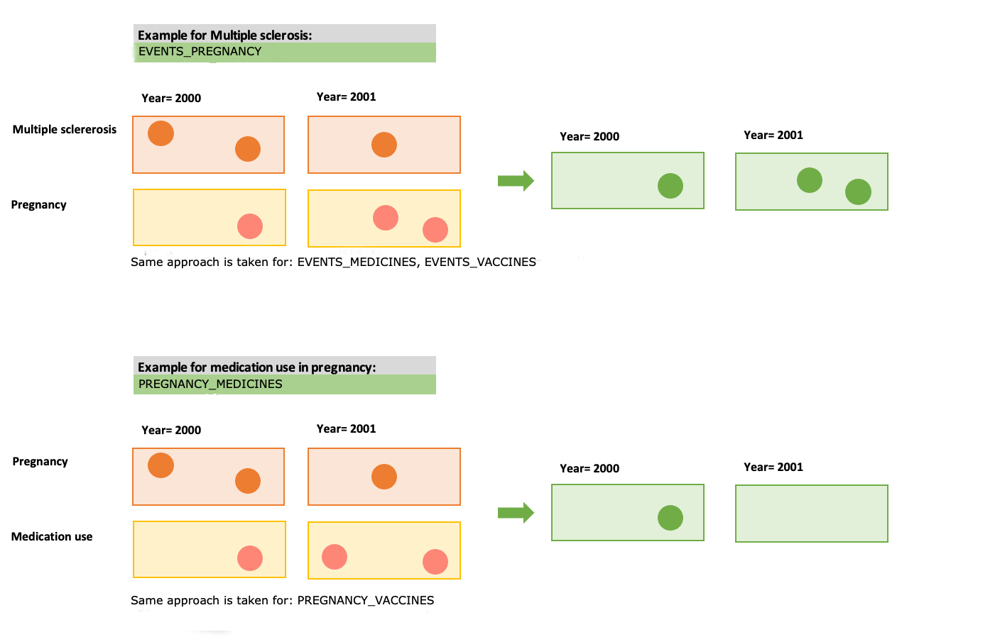
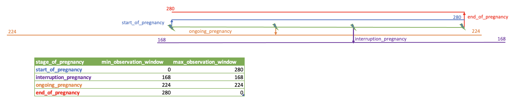

```{css,  echo = F}
/*-- Specify div's for 'boxes', change color of TOC and center align titles: --*/
div.box1 {background-color: #f5f5f0; border-radius: 5px; padding: 30px; margin-right: 0px}
div.box2 {background-color: #d4e5d2; border-radius: 5px; padding: 30px; margin-right: 0px}

div.box3 {border-style: solid; border-color: #f5f5f0; border-width: medium; border-radius: 30px; padding: 5px; margin-right: 0px; text-align: justify}

.list-group-item.active, .list-group-item.active:focus, .list-group-item.active:hover {background-color: #76b82a; border-color: #76b82a}
h1 {text-align: center; color: #3c7b8a}
h2 {text-align: center; color: #76b82a}

/*-- Add logo (based on https://rstudio4edu.github.io/rstudio4edu-book/rmd-fancy.html): --*/
#TOC::before {content: ""; display: block; height: 60px; margin: 30px 10px 30px; background-image: url("conception_logo.png"); background-size: contain; background-position: center center; background-repeat: no-repeat}
```

```{r set_locale, include=FALSE}
Sys.setlocale("LC_ALL", "C")
`%!in%` = Negate(`%in%`)
```

<div class = 'box1'>

**Level 3:** Vaccine exposure in pregnancy

 - **Script directory:** `r projectFolder`
 - **Date/time:** `r Sys.time()`
 - **DAP:** `r data_access_provider_name`
 - **Data source:** `r data_source_name`

</div>

<div class = 'box2'>
```{r time_log, echo=F}
if (subpopulations_present=="No"){
timelog_poi<-fread(paste0(poi_dir,"Time_log/", "time_poi.csv" ))
kable(timelog_poi)
} else {
timelog_poi<-fread(paste0(poi_dir,subpopulations_names[a], "/Time_log/","time_poi.csv"))
kable(timelog_poi)
}
```

```{r, echo=F}
if("timelog_poi" %in% ls()){rm(timelog_poi)}
```
</div>
<div class = 'box1'>
**Level 3:** Counts and prevalence in the populations of interest   
Populations of interest:    

***Pregnancies in:***    
Women with a diagnosis record    

***Medication exposure in:***    
Women with a diagnosis record    
Pregnant women    

***Vaccine exposure in:***    
Women with a diagnosis record    
Pregnant women    


<br> 

The analysis is performed as follows:


<br>

If subpopulations are available in your data the analysis will be performed separately for each subpopulation.
In case there is an overlapping subpopulation only subjects in the overlap period will be taken into account.
***Example:***


<br>

Only pregnancy records with the time window of interest will be analysed. Find below the window of interest for each satge of pregnancy.



<br>

</div>

<br>

<div class = 'box1'>

Used parameters

```{r, echo=F,include=FALSE}
parameter_file_fl<-list.files(paste0(projectFolder,"/p_parameters/"),"study_parameters")
parameter_file<-as.data.table(read_excel(paste0(projectFolder,"/p_parameters/",parameter_file_fl),col_types = "text", sheet = "study_parameters"))
#Set parameters basic parameters
diag <- parameter_file[variable=="diagnoses_of_interest",value]
info_start<-data.table(Indicator=c("List of selected diagnoses"),
                       Value=c(diag))

```

```{r, echo=FALSE}
datatable(info_start)
```

</div>


<div class = 'box3'>

## 1. Vaccine exposure in pregnancy

<br> 
<mark style="background-color: #d4e5d2">All vaccine administration records with date prior to pregnancy date will be discarded.</mark>

Excluded records
```{r echo=F, warning=FALSE}
if (subpopulations_present=="No"){
  if(sum(grepl(list.files(paste0(poi_dir,"PREGNANCY_VACCINES")), pattern="preg_vacc_prior_removed.csv"))>0){
fl<-paste0(poi_dir,"PREGNANCY_VACCINES/")
res_vacc<-fread(paste0(fl,list.files(fl,"preg_vacc_prior_removed.csv")))
if(res_vacc[,.N]>0){
datatable(res_vacc, options = list(scrollX=T))
  } else {
    res_vacc<-NULL
  print("This table cannot be produced based on the available data.")
  }
} else {
  res_vacc<-NULL
  print("This table cannot be produced based on the available data.")
}
} else {
    if(sum(grepl(list.files(paste0(poi_dir,"PREGNANCY_VACCINES/",subpopulations_names[a], "/Masked/")), pattern="preg_vacc_prior_removed.csv"))>0){
      fl<-paste0(poi_dir,"PREGNANCY_VACCINES/",subpopulations_names[a],"/")
    res_vacc<-fread(paste0(fl, list.files(fl, paste0(subpopulations_names[a],"_preg_vacc_prior_removed.csv"))))
    if(res_vacc[,.N]>0){
datatable(res_vacc, options = list(scrollX=T))
    } else {
      res_vacc<-NULL
    print("This table cannot be produced based on the available data.") 
    }
  } else {
    res_vacc<-NULL
    print("This table cannot be produced based on the available data.")
  }
}
```

```{r, echo=F}
if("fl" %in% ls()){rm(fl)}
if("res_vacc" %in% ls()){rm(res_vacc)}
```

<br>

<mark style="background-color: #d4e5d2">All vaccine administration records(by ATC code) with the same date of administration for the same subject will be discarded.</mark>

Excluded duplicated records
```{r echo=F, warning=FALSE}
if (subpopulations_present=="No"){
  if(sum(grepl(list.files(paste0(poi_dir,"PREGNANCY_VACCINES")), pattern="preg_vacc_dup_removed.csv"))>0){
fl<-paste0(poi_dir,"PREGNANCY_VACCINES/")
res_vacc_2<-fread(paste0(fl,list.files(fl,"preg_vacc_dup_removed.csv")))
if(res_vacc_2[,.N]>0){
datatable(res_vacc_2, options = list(scrollX=T))
  } else {
    res_vacc_2<-NULL
  print("This table cannot be produced based on the available data.")
  }
} else {
  res_vacc<-NULL
  print("This table cannot be produced based on the available data.")
}
} else {
    if(sum(grepl(list.files(paste0(poi_dir,"PREGNANCY_VACCINES/",subpopulations_names[a], "/Masked/")), pattern="preg_vacc_dup_removed.csv"))>0){
      fl<-paste0(poi_dir,"PREGNANCY_VACCINES/",subpopulations_names[a],"/")
    res_vacc_2<-fread(paste0(fl, list.files(fl, paste0(subpopulations_names[a],"_preg_vacc_dup_removed.csv"))))
    if(res_vacc_2[,.N]>0){
datatable(res_vacc_2, options = list(scrollX=T))
    } else {
      res_vacc_2<-NULL
    print("This table cannot be produced based on the available data.") 
    }
  } else {
    res_vacc_2<-NULL
    print("This table cannot be produced based on the available data.")
  }
}
```

```{r, echo=F}
if("fl" %in% ls()){rm(fl)}
if("res_vacc_2" %in% ls()){rm(res_vacc_2)}
```

<br>

### Summary of included pregnancy records by stage of pregnancy, meaning and year of pregnancy

```{r echo=F, warning=FALSE}
if (subpopulations_present=="No"){
  if(sum(grepl(list.files(poi_dir), pattern="preg_summary_m_masked.csv"))>0){
res<-fread(paste0(poi_dir,list.files(poi_dir,"preg_summary_m_masked.csv")))
if(res[,.N]>0){
datatable(res, options = list(scrollX=T))
  } else {
    res<-NULL
  print("This table cannot be produced based on the available data.")
  }
} else {
  res<-NULL
  print("This table cannot be produced based on the available data.")
}
} else {
    if(sum(grepl(list.files(paste0(poi_dir,subpopulations_names[a], "/Masked/")), pattern="preg_summary_m_masked.csv"))>0){
      fl<-paste0(poi_dir,subpopulations_names[a], "/Masked/")
    res<-fread(paste0(fl, list.files(fl, paste0(subpopulations_names[a],"_preg_summary_m_masked.csv"))))
    if(res[,.N]>0){
datatable(res, options = list(scrollX=T))
    } else {
      res<-NULL
    print("This table cannot be produced based on the available data.") 
    }
  } else {
    res<-NULL
    print("This table cannot be produced based on the available data.")
  }
}
```

<br>

### Vaccine administration prevalence by ATC code and year of pregnancy

<br>
<mark style="background-color: #d4e5d2">The prevalence is calculated as the number of pregnant women that had a vaccine administration record(as specified by the 3rd level ATC code)  divided by the total number of pregnant women stratified by year of pregnancy.</mark>
<br>

```{r echo=F, warning=FALSE}
if (subpopulations_present=="No"){
  if(sum(grepl(list.files(paste0(poi_dir,"PREGNANCY_VACCINES/Masked/")), pattern="preg_vacc_prevalence_atc_masked.csv"))>0){
fl<-paste0(poi_dir,"PREGNANCY_VACCINES/Masked/")
res_4<-fread(paste0(fl,list.files(fl,"preg_vacc_prevalence_atc_masked.csv")))
if(res_4[,.N]>0){
datatable(res_4, options = list(scrollX=T))
  } else {
    res_4<-NULL
  print("This table cannot be produced based on the available data.")
  }
} else {
  res_4<-NULL
  print("This table cannot be produced based on the available data.")
}
} else {
    if(sum(grepl(list.files(paste0(poi_dir,"PREGNANCY_VACCINES/",subpopulations_names[a], "/Masked/")), pattern="preg_vacc_prevalence_atc_masked.csv"))>0){
      fl<-paste0(poi_dir,"PREGNANCY_VACCINES/",subpopulations_names[a], "/Masked/")
    res_4<-fread(paste0(fl, list.files(fl, paste0(subpopulations_names[a],"_preg_vacc_prevalence_atc_masked.csv"))))
    if(res_4[,.N]>0){
datatable(res_4, options = list(scrollX=T))
    } else {
      res_4<-NULL
    print("This table cannot be produced based on the available data.") 
    }
  } else {
    res_4<-NULL
    print("This table cannot be produced based on the available data.")
  }
}
```

<mark style="background-color: #d4e5d2">Counts smaller than 5 will be replaced with a count of 3. Then the approximate prevalence rates will be calculated as pregnant women that had a dispensing/prescription record divided by number of pregnant women, multiplied by 100.</mark>

```{r , echo=FALSE, warning=FALSE}
if(!is.null(res_4)){
rec_graph<-as.data.table(res_4[no_exposed_pregnancies=="<5", no_exposed_pregnancies:= 3])
rec_graph<-rec_graph[,no_exposed_pregnancies:=as.numeric(no_exposed_pregnancies)]
rec_graph<-rec_graph[no_pregnancies=="<5", no_pregnancies:= 3]
rec_graph<-rec_graph[,no_pregnancies:=as.numeric(no_pregnancies)]
rec_graph<-rec_graph[,year:=as.factor(year)]
rec_graph<-rec_graph[prevalence_vaccine_exposure=="N/A", prevalence_vaccine_exposure:= round((no_exposed_pregnancies/no_pregnancies)*100,2)]
rec_graph<-as.data.table(rec_graph)
#Set columns to the right type
rec_graph[,prevalence_vaccine_exposure:=as.numeric(as.character(prevalence_vaccine_exposure))]

} else {
 rec_graph<-NULL 
}


if(!is.null(rec_graph)){
ggplotly(ggplot(rec_graph, aes(x = year, y = prevalence_vaccine_exposure, group=vaccine_indicator)) +
                           geom_line(aes(color=vaccine_indicator)) +
                           geom_point(aes(color=vaccine_indicator)) + 
                               ggtitle("Vaccine exposure prevalence in pregnancy") + 
                               xlab("Year") +
                               ylab("Prevalence rate per 100 women")+
                             theme_classic() +
                             guides(shape = guide_legend(override.aes = list(size = 0.3))) +
                               theme(text=element_text(size=10),
                                 axis.text.x = element_text(angle = 90, hjust = 1),
                                     axis.title.x = element_text(colour = "#76b82a"),
                                     axis.title.y = element_text(colour = "#76b82a"),
                                     plot.title = element_text(colour = "#76b82a"),
                                     strip.text.y = element_text(angle = 0),
                                     legend.title = element_text(size = 6),
               legend.text = element_text(size = 6))) 
                                     
} 
```


```{r, echo=F}
if("fl" %in% ls()){rm(fl)}
if("res_4" %in% ls()){rm(res_5)}
if("res_graph" %in% ls()){rm(res_graph)}
```

<br> 


### Vaccine administrations prevalence by stage of pregnancy, ATC code and year

<br>
<mark style="background-color: #d4e5d2">The prevalence is calculated as the number of pregnant women that had a vaccine administration record(as specified by the 3rd level ATC code)  divided by the total number of pregnant women stratified by stage of pregnancy and year of pregnancy.</mark>
<br>

```{r echo=F, warning=FALSE}
if (subpopulations_present=="No"){
  if(sum(grepl(list.files(paste0(poi_dir,"PREGNANCY_VACCINES/Masked/")), pattern="preg_vacc_prevalence_s_masked.csv"))>0){
fl<-paste0(poi_dir,"PREGNANCY_VACCINES/Masked/")
res_4<-fread(paste0(fl,list.files(fl,"preg_vacc_prevalence_s_masked.csv")))
if(res_4[,.N]>0){
datatable(res_4, options = list(scrollX=T))
  } else {
    res_4<-NULL
  print("This table cannot be produced based on the available data.")
  }
} else {
  res_4<-NULL
  print("This table cannot be produced based on the available data.")
}
} else {
    if(sum(grepl(list.files(paste0(poi_dir,"PREGNANCY_VACCINES/",subpopulations_names[a], "/Masked/")), pattern="preg_vacc_prevalence_s_masked.csv"))>0){
      fl<-paste0(poi_dir,"PREGNANCY_VACCINES/",subpopulations_names[a], "/Masked/")
    res_4<-fread(paste0(fl, list.files(fl, paste0(subpopulations_names[a],"_preg_vacc_prevalence_s_masked.csv"))))
    if(res_4[,.N]>0){
datatable(res_4, options = list(scrollX=T))
    } else {
      res_4<-NULL
    print("This table cannot be produced based on the available data.") 
    }
  } else {
    res_4<-NULL
    print("This table cannot be produced based on the available data.")
  }
}
```

<mark style="background-color: #d4e5d2">Counts smaller than 5 will be replaced with a count of 3. Then the approximate prevalence rates will be calculated as number of exposed pregnancies divided by number of pregnancies, multiplied by 100.</mark>

```{r , echo=FALSE, warning=FALSE}
if(!is.null(res_4)){
rec_graph<-as.data.table(res_4[no_exposed_pregnancies=="<5", no_exposed_pregnancies:= 3])
rec_graph<-rec_graph[,no_exposed_pregnancies:=as.numeric(no_exposed_pregnancies)]
rec_graph<-rec_graph[no_pregnancies=="<5", no_pregnancies:= 3]
rec_graph<-rec_graph[,no_pregnancies:=as.numeric(no_pregnancies)]
rec_graph<-rec_graph[,year:=as.factor(year)]
rec_graph<-rec_graph[prevalence_vaccine_exposure=="N/A", prevalence_vaccine_exposure:= round((no_exposed_pregnancies/no_pregnancies)*100,2)]
rec_graph<-as.data.table(rec_graph)
#Set columns to the right type
rec_graph[,prevalence_vaccine_exposure:=as.numeric(as.character(prevalence_vaccine_exposure))]

} else {
 rec_graph<-NULL 
}


if(!is.null(rec_graph)){
ggplotly(ggplot(rec_graph, aes(x = year, y = prevalence_vaccine_exposure, group=stage_of_pregnancy)) +
                           geom_line(aes(color=stage_of_pregnancy)) +
                           geom_point(aes(color=stage_of_pregnancy)) + 
                               ggtitle("Vaccine exposure prevalence in pregnancy") + 
                               xlab("Year") +
                               ylab("Prevalence rate per 100 women")+
                             theme_classic() +
                             guides(shape = guide_legend(override.aes = list(size = 0.3))) +
                               theme(text=element_text(size=10),
                                 axis.text.x = element_text(angle = 90, hjust = 1),
                                     axis.title.x = element_text(colour = "#76b82a"),
                                     axis.title.y = element_text(colour = "#76b82a"),
                                     plot.title = element_text(colour = "#76b82a"),
                                     strip.text.y = element_text(angle = 0),
                                     legend.title = element_text(size = 6),
               legend.text = element_text(size = 6))) 
                                     
} 
```


```{r, echo=F}
if("fl" %in% ls()){rm(fl)}
if("res_4" %in% ls()){rm(res_4)}
```
<br> 

### Vaccine administrations prevalence by ATC code and year

<br>
<mark style="background-color: #d4e5d2">The prevalence is calculated as the number of pregnant women that had a vaccine administration record(as specified by the 3rd level ATC code)  divided by the total number of pregnant women stratified by year of pregnancy.</mark>
<br>

```{r echo=F, warning=FALSE}
if (subpopulations_present=="No"){
  if(sum(grepl(list.files(paste0(poi_dir,"PREGNANCY_VACCINES/Masked/")), pattern="preg_vacc_prevalence_y_masked.csv"))>0){
fl<-paste0(poi_dir,"PREGNANCY_VACCINES/Masked/")
res_5<-fread(paste0(fl,list.files(fl,"preg_vacc_prevalence_y_masked.csv")))
if(res_5[,.N]>0){
datatable(res_5, options = list(scrollX=T))
  } else {
    res_5<-NULL
  print("This table cannot be produced based on the available data.")
  }
} else {
  res_5<-NULL
  print("This table cannot be produced based on the available data.")
}
} else {
    if(sum(grepl(list.files(paste0(poi_dir,"PREGNANCY_VACCINES/",subpopulations_names[a], "/Masked/")), pattern="preg_vacc_prevalence_y_masked.csv"))>0){
      fl<-paste0(poi_dir,"PREGNANCY_VACCINES/",subpopulations_names[a], "/Masked/")
    res_5<-fread(paste0(fl, list.files(fl, paste0(subpopulations_names[a],"_preg_vacc_prevalence_y_masked.csv"))))
    if(res_5[,.N]>0){
datatable(res_5, options = list(scrollX=T))
    } else {
      res_5<-NULL
    print("This table cannot be produced based on the available data.") 
    }
  } else {
    res_5<-NULL
    print("This table cannot be produced based on the available data.")
  }
}
```

<mark style="background-color: #d4e5d2">Counts smaller than 5 will be replaced with a count of 3. Then the approximate prevalence rates will be calculated as number of exposed pregnancies divided by number of pregnancies, multiplied by 100.</mark>

```{r , echo=FALSE, warning=FALSE}
if(!is.null(res_5)){
rec_graph<-as.data.table(res_5[no_exposed_pregnancies=="<5", no_exposed_pregnancies:= 3])
rec_graph<-rec_graph[,no_exposed_pregnancies:=as.numeric(no_exposed_pregnancies)]
rec_graph<-rec_graph[no_pregnancies=="<5", no_pregnancies:= 3]
rec_graph<-rec_graph[,no_pregnancies:=as.numeric(no_pregnancies)]
rec_graph<-rec_graph[,year:=as.factor(year)]
rec_graph<-rec_graph[prevalence_vaccine_exposure=="N/A", prevalence_vaccine_exposure:= round((no_exposed_pregnancies/no_pregnancies)*100,2)]
rec_graph<-as.data.table(rec_graph)
#Set columns to the right type
rec_graph[,prevalence_vaccine_exposure:=as.numeric(as.character(prevalence_vaccine_exposure))]

} else {
 rec_graph<-NULL 
}


if(!is.null(rec_graph)){
ggplotly(ggplot(rec_graph, aes(x = year, y = prevalence_vaccine_exposure)) +
                           geom_line(aes(color=prevalence_vaccine_exposure)) +
                           geom_point(aes(color=prevalence_vaccine_exposure)) + 
                               ggtitle("Vaccine exposure prevalence in pregnancy") + 
                               xlab("Year") +
                               ylab("Prevalence rate per 100 women")+
                             theme_classic() +
                             guides(shape = guide_legend(override.aes = list(size = 0.3))) +
                               theme(text=element_text(size=10),
                                 axis.text.x = element_text(angle = 90, hjust = 1),
                                     axis.title.x = element_text(colour = "#76b82a"),
                                     axis.title.y = element_text(colour = "#76b82a"),
                                     plot.title = element_text(colour = "#76b82a"),
                                     strip.text.y = element_text(angle = 0),
                                     legend.title = element_text(size = 6),
               legend.text = element_text(size = 6))) 
                                     
} 
```

```{r, echo=F}
if("fl" %in% ls()){rm(fl)}
if("res_5" %in% ls()){rm(res_5)}
if("res_graph" %in% ls()){rm(res_graph)}
if("fig.1" %in% ls()){rm(fig.1)}
```

<br> 

### Number of vaccine administrations by stage of pregnancy, ATC code and year

<br>
<mark style="background-color: #d4e5d2">The percentage is calculated as the number of vaccine administration records(as specified by the 3rd level ATC code) in pregnancy divided by the total number of records in pregnant women stratified by stage of pregnancy and year of vaccine administration.</mark>
<br>

```{r echo=F, warning=FALSE}
if (subpopulations_present=="No"){
  if(sum(grepl(list.files(paste0(poi_dir,"PREGNANCY_VACCINES/Masked/")), pattern="preg_vacc_counts_ys_masked.csv"))>0){
fl<-paste0(poi_dir,"PREGNANCY_VACCINES/Masked/")
res_6<-fread(paste0(fl,list.files(fl,"preg_vacc_counts_ys_masked.csv")))
if(res_6[,.N]>0){
datatable(res_6, options = list(scrollX=T))
  } else {
    res_6<-NULL
  print("This table cannot be produced based on the available data.")
  }
} else {
  res_6<-NULL
  print("This table cannot be produced based on the available data.")
}
} else {
    if(sum(grepl(list.files(paste0(poi_dir,"PREGNANCY_VACCINES/",subpopulations_names[a], "/Masked/")), pattern="preg_vacc_counts_ys_masked.csv"))>0){
      fl<-paste0(poi_dir,"PREGNANCY_VACCINES/",subpopulations_names[a], "/Masked/")
    res_6<-fread(paste0(fl, list.files(fl, paste0(subpopulations_names[a],"_preg_vacc_counts_ys_masked.csv"))))
    if(res_6[,.N]>0){
datatable(res_6, options = list(scrollX=T))
    } else {
      res_6<-NULL
    print("This table cannot be produced based on the available data.") 
    }
  } else {
    res_6<-NULL
    print("This table cannot be produced based on the available data.")
  }
}
```

<mark style="background-color: #d4e5d2">Counts smaller than 5 will be
replaced with a count of 3. Then the approximate percentage will be
calculated as number of records divided by total number of records and
multiplied by 100. When the number of records is zero it is not shown in
the graph. See graph
`Vaccine exposure prevalence by stage of pregnancy and year of pregnancy`
for detailed information.</mark>

```{r , echo=FALSE, warning=FALSE}
if(!is.null(res_6)){
rec_graph<-as.data.table(res_6[no_records=="<5", no_records:= 3])
rec_graph<-rec_graph[,no_records:=as.numeric(no_records)]
rec_graph<-rec_graph[total_records=="<5", total_records:= 3]
rec_graph<-rec_graph[,total_records:=as.numeric(total_records)]
rec_graph<-rec_graph[,year:=as.factor(year)]
rec_graph<-rec_graph[percentage=="N/A", percentage:= round((no_records/total_records)*100,2)]
rec_graph<-as.data.table(rec_graph)
#Set columns to the right type
rec_graph[,percentage:=as.numeric(as.character(percentage))]

} else {
 rec_graph<-NULL 
}


if(!is.null(rec_graph)){
  fig.1<-vector(mode="list", length=length(unique(rec_graph[,stage_of_pregnancy])))
for(i in 1:length(unique(rec_graph[,stage_of_pregnancy]))){
rec_graph[stage_of_pregnancy==unique(rec_graph[,stage_of_pregnancy])[i]]
fig.1[[i]]<-ggplotly(ggplot(rec_graph[stage_of_pregnancy==unique(rec_graph[,stage_of_pregnancy])[i]], aes(x = year, y = percentage, group=vaccine_indicator)) +
                           geom_line(aes(color=vaccine_indicator)) +
                           geom_point(aes(color=vaccine_indicator)) + 
                               ggtitle(paste0("Vaccine exposure:", unique(rec_graph[,stage_of_pregnancy])[i])) + 
                               xlab("Year") +
                               ylab("Percentage")+
                             theme_classic() +
                             guides(shape = guide_legend(override.aes = list(size = 0.3))) +
                               theme(text=element_text(size=10),
                                 axis.text.x = element_text(angle = 90, hjust = 1),
                                     axis.title.x = element_text(colour = "#76b82a"),
                                     axis.title.y = element_text(colour = "#76b82a"),
                                     plot.title = element_text(colour = "#76b82a"),
                                     strip.text.y = element_text(angle = 0),
                                     legend.title = element_text(size = 6),
               legend.text = element_text(size = 6))) 
                                     
} 
  }
```

```{r , echo=FALSE}
if(!is.null(res_6)){
htmltools::tagList(list(fig.1))
} else {
  print("This table cannot be produced based on the available data.") 
}
```

```{r, echo=F}
if("fl" %in% ls()){rm(fl)}
if("res_6" %in% ls()){rm(res_6)}
if("res_graph" %in% ls()){rm(res_graph)}
if("fig.1" %in% ls()){rm(fig.1)}
```

<br>
### Number of vaccine administration records by stage of pregnancy, meaning, ATC code and year

<br>
<mark style="background-color: #d4e5d2">The percentage is calculated as the number of vaccine administration records(as specified by the 3rd level ATC code) in pregnancy divided by the total number of records in pregnant women stratified by stage of pregnancy, meaning and year of vaccine administration. \n
The meaning variable is created by combining together the meaning of the pregnancy record and the meaning of the vaccine administration record.</mark>
<br>

```{r echo=F, warning=FALSE}
if (subpopulations_present=="No"){
  if(sum(grepl(list.files(paste0(poi_dir,"PREGNANCY_VACCINES/Masked/")), pattern="preg_vacc_counts_ym_masked.csv"))>0){
fl<-paste0(poi_dir,"PREGNANCY_VACCINES/Masked/")
res_6<-fread(paste0(fl,list.files(fl,"preg_vacc_counts_ym_masked.csv")))
if(res_6[,.N]>0){
datatable(res_6, options = list(scrollX=T))
  } else {
    res_6<-NULL
  print("This table cannot be produced based on the available data.")
  }
} else {
  res_6<-NULL
  print("This table cannot be produced based on the available data.")
}
} else {
    if(sum(grepl(list.files(paste0(poi_dir,"PREGNANCY_VACCINES/",subpopulations_names[a], "/Masked/")), pattern="preg_vacc_counts_ym_masked.csv"))>0){
      fl<-paste0(poi_dir,"PREGNANCY_VACCINES/",subpopulations_names[a], "/Masked/")
    res_6<-fread(paste0(fl, list.files(fl, paste0(subpopulations_names[a],"_preg_vacc_counts_ym_masked.csv"))))
    if(res_6[,.N]>0){
datatable(res_6, options = list(scrollX=T))
    } else {
      res_6<-NULL
    print("This table cannot be produced based on the available data.") 
    }
  } else {
    res_6<-NULL
    print("This table cannot be produced based on the available data.")
  }
}
```

<mark style="background-color: #d4e5d2">Counts smaller than 5 will be
replaced with a count of 3. Then the approximate percentage will be
calculated as number of records divided by total number of records and
multiplied by 100. When the number of records is zero it is not shown in
the graph. See graph
`Vaccine exposure prevalence by stage of pregnancy and year of pregnancy`
for detailed information.</mark>

```{r , echo=FALSE, warning=FALSE}
if(!is.null(res_6)){
rec_graph<-as.data.table(res_6[no_records=="<5", no_records:= 3])
rec_graph<-rec_graph[,no_records:=as.numeric(no_records)]
rec_graph<-rec_graph[total_records=="<5", total_records:= 3]
rec_graph<-rec_graph[,total_records:=as.numeric(total_records)]
rec_graph<-rec_graph[,year:=as.factor(year)]
rec_graph<-rec_graph[percentage=="N/A", percentage:= round((no_records/total_records)*100,2)]
rec_graph<-as.data.table(rec_graph)
#Set columns to the right type
rec_graph[,percentage:=as.numeric(as.character(percentage))]
rec_graph[,atc_meaning:=paste(vaccine_indicator,meaning, sep=":")]
} else {
 rec_graph<-NULL 
}


if(!is.null(rec_graph)){
  fig.1<-vector(mode="list", length=length(unique(rec_graph[,stage_of_pregnancy])))
for(i in 1:length(unique(rec_graph[,stage_of_pregnancy]))){
rec_graph[stage_of_pregnancy==unique(rec_graph[,stage_of_pregnancy])[i]]
fig.1[[i]]<-ggplotly(ggplot(rec_graph[stage_of_pregnancy==unique(rec_graph[,stage_of_pregnancy])[i]], aes(x = year, y = percentage, group=atc_meaning)) +
                           geom_line(aes(color=atc_meaning)) +
                           geom_point(aes(color=atc_meaning)) + 
                               ggtitle(paste0("Vaccine exposure:", unique(rec_graph[,stage_of_pregnancy])[i])) + 
                               xlab("Year") +
                               ylab("Percentage")+
                             theme_classic() +
                             guides(shape = guide_legend(override.aes = list(size = 0.3))) +
                               theme(text=element_text(size=10),
                                 axis.text.x = element_text(angle = 90, hjust = 1),
                                     axis.title.x = element_text(colour = "#76b82a"),
                                     axis.title.y = element_text(colour = "#76b82a"),
                                     plot.title = element_text(colour = "#76b82a"),
                                     strip.text.y = element_text(angle = 0),
                                     legend.title = element_text(size = 6),
               legend.text = element_text(size = 6))) 
                                     
} 
  }
```

```{r , echo=FALSE}
if(!is.null(res_6)){
htmltools::tagList(list(fig.1))
} else {
  print("This table cannot be produced based on the available data.") 
}
```

```{r, echo=F}
if("fl" %in% ls()){rm(fl)}
if("res_6" %in% ls()){rm(res_6)}
if("res_graph" %in% ls()){rm(res_graph)}
if("fig.1" %in% ls()){rm(fig.1)}
```

</div>


<br>

<div class = 'box2'>

Author: Vjola Hoxhaj Drs.   
email: v.hoxhaj@umcutrecht.nl   
Organisation: UMC Utrecht, Utrecht, The Netherlands    

</div>
